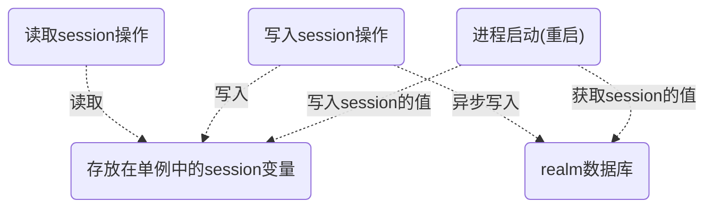

## 客户端

其实最开始本打算是用自己更熟悉的C#来开发一个windows桌面程序来作为客户端，但考虑到系统的应用场景，觉得还是移动端的客户端更加适合这个系统，因为移动端比起桌面端有更高的即时性，用户能够在有新的变化时第一时间得知，加上自己也想挑战一下自我，因此最后选择了用自己没什么经验的安卓平台。


但由于客户端是基于安卓平台开发的，而在编写客户端前，自己并没有安卓开发的经验，可以说是边学边敲代码，一点一点完善的。也正因为如此，客户端的设计、编码有不少不规范，不成熟的地方，所以对于客户端我就不像服务端那样详细讲解献丑了，有兴趣可以自行看下源码，使用的语言为kotlin：（代码有些需要修改的地方，源码过几天再公开）


作为代替，我打算讲一下我在进行安卓开发的过程中遇到的难题，和我的解决方案，它们分别是：

<ol>
<li><a href="#1-静态类或静态变量的使用问题">静态类或静态变量的使用问题</a></li>
<li><a href="#2-瞬时数据和持久数据之间平衡的问题">瞬时数据和持久数据之间平衡的问题</a></li>
<li><a href="#3-fragment之间的通信与数据存储的问题">Fragment之间的通信与数据存储的问题</a></li>
<li><a href="#4-界面流畅性的问题">界面流畅性的问题</a></li>
<li><a href="#5-方法数超过64k的问题">方法数超过64k的问题</a></li>
</ol>

以下我将会按顺序讲解：


#### 1. 静态类或静态变量的使用问题

这大概是我在开发的过程中遇到的最麻烦的问题吧。和windows桌面程序开发、linux服务器开发不同，安卓开发中静态类(变量)的使用必须慎之又慎。由于安卓组件（Activity、fragment等）的生命周期和安卓进程的生命周期并不一致，静态变量使用不当会发生各种问题，如**内存泄露**、**进程被回收**导致的引用置null而引起的程序崩溃等等。

内存泄露的问题暂且不提，先谈谈进程被回收的问题。比如说登录，登录成功后，将session(token)存放在静态类(或单例)中，每次发起请求都从静态类(或单例)取session进行通信，这样乍看起来没什么不妥，事实上我最开始也是这么做的，因为开发Windows程序时一直都是这种流程，但没多久我就知道安卓开发不能这样。

问题的根源在于安卓独特的生命周期和组件特性：安卓中运行的应用是不稳定的，进程随时可能被回收。比如说用户暂时不需要用某个应用了，但没有完全关闭而是切换到后台。过了一会儿系统内存不够用了于是回收了那个应用的进程。然后再过了一会儿，用户再次需要用到那个应用，然而应用所在的进程已经被回收，这时会发生什么呢？会为该应用重新启动一个进程。

然而麻烦的是，为应用重新启动一个进程，和重启应用，是不同的概念。应用所在进程如果不是主动关闭应用而是被系统回收的话，系统在应用所在进程被回收前，会记录应用当前所在的Activity及其他一些必要信息。这样，下次点开应用，系统在重新建立进程后，会还原上次最后停留的Activity。**问题就出在这里**，虽然Activiy被还原了，但静态变量、静态类里存放的信息因为已经是不同的进程了，所以在上个进程里存放的信息自然就丢失了。如果session(token)存放在静态类里的话，访问那个值自然会得到null从而导致异常。


那么该怎么办呢？静态类、静态变量确实能带来很多便利，而且在某些场合强行避免使用静态类(变量)而改用其他手段的话，可能会增加很多工作量，代码也会变得繁琐、可读性差。难道真的不能用吗？其实并不是，事实上，我在编码中还是将session(token)存放在了静态类里面，但不是直接存放而是做了些额外工作，至于具体是怎么做的，这里请容我先卖个关子，放到下个问题里讲。总之，经过我自己查资料、反复思考，最后得到的结论是，**静态类或静态变量可以使用，但要注意以下两点**：

1. 避免存放生命周期和进程本身生命周期不一致的对象的引用，以避免内存泄露的问题，比如说Activity的引用，如果一定要使用，记得要使用弱引用(WeakReference)，让其能够被GC回收。
2. 给静态类(变量)存放的内容提供一种恢复手段，使之就算在进程被回收重启后，其内容能够被正常的恢复。


至于恢复手段是什么，这就涉及到我要讲的下个问题了。


#### 2. 瞬时数据和持久数据之间平衡的问题

内存中保存的数据是瞬时的，不管是windows程序也好，linux的后台程序也罢，一些长久需要的数据我们总是要想办法将其持久化，这样下次启动时程序才能正常工作。

**而持久化的问题在安卓应用中显得更为重要。**拿我常开发的Windows程序相比较，Windows程序的瞬时数据就算不马上持久化，也可以在程序完成一项作业告一段落，或程序关闭时再进行保存，虽然这样有可能会因程序崩溃或断电等情况导致瞬时数据丢失未能及时保存，但这种情况毕竟比较少，相对来说在可接受范围。

而在安卓应用开发中，由于安卓系统的进程回收机制，这种散漫的思维方式是很危险的。对于内存中存放的瞬时数据必须保持警惕，因为安卓应用所在的进程随时可能被回收，瞬时数据随时可能丢失。Windows程序的持久数据可以只保存一些初始化需要用到的数据，保证程序重启是正常运作即可。但在安卓应用中，由于**进程被杀死≠应用结束**，就算进程被杀死，系统还是会尝试去还原应用的运行状态，继续上次的工作，因此**安卓应用不仅需要持久化初始化数据，也要持久化一些运行状态数据，以保证程序的正常运作。**比如说session(token)，在Windows程序中可以不被持久化，大不了下次重新登录；但在安卓应用中必须被持久化，不然每次进程被杀死我们都得被迫重新登录（就算用户并没有重新登录的意愿），而在安卓系统中，进程被杀死实在不是什么稀奇的事情，那用户体验就可想而知了。

也就是说，除了一些程序在运行到一半丢失了也无关紧要的数据之外，一切数据都要想办法持久化。而持久化一定会涉及到永久存储介质的读写，虽然现在手机、平板的存储介质读取速度已经很快，但和内存相比速度还是有很大欠缺的。因此，**持久化操作虽然重要，但过于频繁、不恰当的持久化操作会影响应用的性能。使用瞬时数据还是使用持久数据，它们之间如何转化，应该有个方案。**


对于一些数据，如果不使用瞬时数据而全部改用持久数据来存取的话，固然能让应用变得可靠，但会有很大的性能损耗。而如果全部改用瞬时数据的话，虽然性能有了，但代价就是应用变得不稳定，进程被杀死后没有办法还原到被杀死前的状态。有没有什么折中的方案，能够同时兼具两者的优点？答案是有。


对于这个项目的场景，我的方案是这样的：

* 写入数据时，同一份数据先写入瞬时数据(内存)，再**异步**写入到持久数据(永久存储介质)。
* 在进程启动(或重启)进行初始化时，读取持久数据并存入瞬时数据。
* 除了特殊情况，平时读取数据一律读取瞬时数据。


这样做的话，性能方面，平时读取数据时读取的是瞬时速度，速度非常快，写数据时虽然会写入持久数据，但因为是异步进行，对应用反应速度，用户体验的影响微乎其微；可靠性方面，虽然还是会存取持久数据，但读持久数据的操作变成了只会在初始化时读取一次。这样做，既保证了一定程度的可靠性，又保证了一定程度的性能。（当然，这个方案不适用于所有项目，对用到的数据比较庞大，持久化数据没办法一次性全部加载到内存的场景不适合用这种方案。）


让我们重新回到上个问题里提到的session存放的问题。我说了，安卓中静态类（或单例模式）可以用，只要注意内存泄露的问题，以及提供一种恢复数据的手段。而我采用的恢复数据的手段，就是从持久化数据中恢复。


先上代码：

```kotlin
object LoginHelper {
    private var mSession : String = ""
    val session get() = mSession

    private var mUsername : String = ""
    private var mPassword : String = ""

    private lateinit var mConnectionOption : ConnectionOption
    val connectionOption get() = mConnectionOption

    val isLoggedIn : Boolean
        get() = mSession!=""

    fun init(realm:Realm){
        mConnectionOption = ConnectionOption(SettingHelper.serverIp,SettingHelper.serverPort)

        var profile = realm.where<RProfile>().equalTo("id",0L).findFirst()
        if(profile!=null){
            mSession = profile.session
            mUsername = profile.username
            mPassword = profile.password
        }
    }

    fun login(jobQueryResultInfoRepo : IJobQueryResultInfoRepository? = null)
            =login("","", mSession,jobQueryResultInfoRepo)

    fun login(username:String,password:String,jobQueryResultInfoRepo : IJobQueryResultInfoRepository? = null)
            =login(username,password, "",jobQueryResultInfoRepo)

    private fun login(username:String,password:String,session:String,
              jobQueryResultInfoRepo : IJobQueryResultInfoRepository? = null) : Single<Boolean>
        = RequestHelper.login(username,password, session)
            .map {response->
                mSession = response.session

                realmTaskWorker.enqueueTask { realm ->
                    try {
                        var profile = realm.where<RProfile>().equalTo("id", 0L).findFirst()
                        if(profile==null) {
                            profile = realm.createObject<RProfile>(0L)
                            profile!!.username = username
                            mUsername = username
                            profile!!.password = password
                            mPassword = password
                        }
                        profile.session = mSession
                    } catch (e: Exception) {
                        e.printStackTrace()
                    }
                }

                JobRelatedInfo.loadFromProtoBuf(response.jobRelatedInfo)
                jobQueryResultInfoRepo?.setJobQueryResultInfoList(JobQueryResultInfo.fromProtoBufList(response.jobQueryResultInfo))
                true
            }

}
```

可以看到，在执行``login()``登录后，session会作为成员变量被保存在单例里，但同时也会被持久化保存到Realm数据库。而在Application类的``onCreate()``方法会调用``LoginHelper.init()``，如此一来，如果进程被杀死重启的话，session会从Realm数据库中恢复数据，这样就解决了进程被杀死后session变量值被置为了null的问题。

这里我采用的持久化手段是Realm数据库。因为读写数据库是耗时操作，所以如果不想影响程序性能，读写数据库应采用异步的方式。Realm自带异步提交事务的实现，我看过源码，采用的是线程池的方式。不过我并没有直接采用自带的异步方法，而是专门开了一个工作线程，用任务阻塞队列的方式来实现异步，原因是：

1. 发生异常时可以自定义一些日志，方便定位错误
2. 用线程池来提交数据库事务在本项目的场景中有点“小题大做”了。使用线程池的话，同时提交的数据库事务将会并行执行，这比起阻塞队列的串行执行确实会快不少，但这同时也意味着更高的花费。而在本项目中，数据库操作只是起到一个持久化的作用，重要的是瞬时数据持久化这个动作，对数据被持久化的速度并没有非常严苛的要求。比如说，就算持久数据的更新比瞬时数据慢半秒甚至是1秒，在本项目的场景中也是可以接受的，因为程序所在进程刚好在1秒内被杀死的概率实在不高。


用流程图总结一下session的存取：



项目中一些其他需要持久化的数据如配置数据等也是采用这种方式进行存取。


#### 3. Fragment之间的通信与数据存储的问题

在我的项目中，我采取的是使用一个MainActivity，然后多个Fragment之间相互切换的方式来实现页面跳转。而在进行跳转时，有些数据要从上个Fragment传递到下个Fragment，而究竟该采取何种方式通信，这个问题也曾困扰了我挺长一段时间。

我曾采取过以下两种方案：

1. 使用Bundle类，Fragment跳转时用``fragment.arguments = bundle``的方式传递所需要的信息。
2. 将Fragment之间需要的共享数据存放在它们的宿主activity中。


而这两种方案经过我的实践，最后也被我否决了。

**方案1**有两个问题，一个问题是通过Bundle类传递复杂对象的话，需要将对象序列化，数据量比较大的话效率不是很好，这个问题其实影响还不算很大；另一个更严重的问题是通过Bundle类的通信本质是值传递，虽然对象可以用序列化反序列化的方式传递，但通过这种方式传递过去的对象，虽然它们的值相同，但它们其实已经不是同一个对象了，那么如果对象里的某个成员如果在另一个Fragment中发生了改变的话，就会引起数据不一致的情况。

举个例子，Job(职位)对象里有个成员是``hasBeenSeen``，作用是指示该职位是否已被用户阅览过。那么，假设用户现在在职位查询结果的列表页，点击某个列表项，跳转到某个职位的详情页面，如果job对象的传递方式采用方案1的话，就算在详情页的Fragment中设置了``job.hasBeenSeen = true``，表示该职位已被阅览，在退回到列表页时，会发现那个职位项还是未读的状态。原因是列表页中的job对象和详情页中的job对象，经过序列化和反序列化后，其实已经不是同一个对象了，尽管它们的值看上去一模一样。所以就算改变了详情页中job对象的值，列表页中的job对象也没法同步更新。


**方案2**解决了方案1中遇到的问题，Fragment之间需要共享的数据放到它们的宿主Activity中，在fragment之间用``activity.data``的方式读写它们的共享数据。这种方法有个显而易见的问题就是导致逻辑混乱，一些可能跟宿主Activity没什么关系的数据，只是为了共享就把它们放在Activity中，会让代码显得很杂乱，违反了高内聚的原则。另外还有个问题是这份数据还要采取额外的措施进行保护。方案1中，fragment就算被销毁重新创建，arguments中的参数还在。而如果采取方案2，Activity在被销毁重新创建(比如在旋转屏幕时)时，其数据也会跟着销毁，必须通过``onSaveInstanceState()``和``onRestoreInstanceState()``进行数据的备份和还原，而这又需要额外的工作量。


可以看到，方案1和方案2都不是很完美的解决方案，有没有什么更好的方法呢？在我翻看安卓开发官方指南时，终于找到了自己的答案，**那就是使用``ViewModel``**。ViewModel在每个Activity和每个Fragment中对应的实例的唯一的，Fragment之间可以通过宿主Activity所持有的ViewModel来通信。

参考链接：[](https://developer.android.com/training/basics/fragments/communicating)


使用ViewModel来存储数据，有以下好处：

1. 分离职责，减少Activity需要做的事情，让代码变得更加清晰。
2. 在Activity被销毁重建时，ViewModel不会被销毁，不用再去烦心数据备份和恢复的问题。
3. 可以使用观测者被观测者模式，在ViewModel中的数据发生变动的那一刻直接通知所有观测者Fragment，进行相应的更新。


ViewModel在Activity被销毁重建时不被销毁的原理，本质是利用了Fragment``setRetainInstance(true)``，使得Fragment在Activity被销毁重建时不被销毁，而ViewModel就是被保存在了这么一个不可见的Fragment中。具体原理和源码网上已经有人解析过，这里就不展开讲了。

总之，ViewModel非常适合保存与Activity或Fragment相关的瞬时数据，客户端中的很多业务数据，如职位信息等都被我存放在了ViewModel里，比如说职位信息的ViewModel：

```kotlin
class JobViewModel : ViewModel() , IJobRepository {
    private val mJobMap = HashMap<Int,Job>()

    override val myFavoriteJobs = ArrayList<Job>()
    override val historyOfJobViewed = ArrayList<Job>()

    val myFavoriteJobsClone : ArrayList<Job> get() {
        val list = ArrayList<Job>()
        list.addAll(myFavoriteJobs)
        return list
    }

    override fun addToFavorite(job: Job) {
        if(!myFavoriteJobs.contains(job))myFavoriteJobs.add(job)
    }

    override fun deleteFromFavorite(job: Job) {
        myFavoriteJobs.remove(job)
    }

    override fun addToHistory(job: Job) {
        historyOfJobViewed.remove(job)
        historyOfJobViewed.add(job)
    }

    override fun deleteFromHistory(job: Job) {
        historyOfJobViewed.remove(job)
    }

    override fun get(id: Int): Job? {
        return mJobMap[id]
    }

    override fun save(job: Job) {
        mJobMap[job.id] = job
    }

}
```

其中IJobRepository是我定义的接口，意思是职位仓库，用来存储职位对象的地方。ViewModel正是一个适合实现职位仓库的载体。

这样一来，在每个fragment中都能很方便地通过职位的id获取职位对象，比如：

```kotlin
val jobViewModel = ViewModelProviders.of(activity).get(JobViewModel::class.java)
val job = jobViewModel.get(id);
```


甚至可以结合静态变量静态方法，实现不需要activity实例就能获取job实例，流程如下：

1. 首先在Activity的``onCreate()``方法中，将jobViewModel的实例传入职位类

   ```kotlin
   val jobViewModel = ViewModelProviders.of(this).get(JobViewModel::class.java)
   Job.setRepository(jobViewModel)
   ```

2. 在职位类中，保存一个对职位仓库的弱引用：

   ```kotlin
   data class Job
   {
       //...
       companion object{
           private var sRepo by Weak<IJobRepository>()//职位仓库的弱引用
           fun getInstance(id:Int) : Job? = sRepo?.get(id)
   		fun setRepository(jobRepo:IJobRepository){
               sRepo=jobRepo
           }
       }
       
   }
   ```

   因为是弱引用所以不用担心内存泄露的问题，只要职位仓库可用，我们直接可以通过``Job.getInstance(id)``的方式，获取到职位实例，而且通过这种方式获取到的职位实例是唯一的，所有用到了这个对象Fragment，在其数据发生变更的那一刻都能同步更新。


ViewModel解决了我烦恼了很久的瞬时数据的存储及通信问题，不再需要去重写onSaveInstanceState()、onRestoreInstanceState()，提高编码效率，增加了代码的可读性。


#### 4. 界面流畅性的问题

根据安卓官方优化指南，要使界面流畅，我们在每一帧中花在CPU与GPU计算，绘制，渲染等等操作的时间，不能超过16ms。超过这个时间的话，肉眼能够捕捉到卡顿，因此会给用户带来一些不好的体验。

如果在调试时看到类似的字样，那就说明该进行优化了：*Skipped xx frames! The application may be doing too much work on its main thread.*


那么怎样减少这个时间呢，我主要从两方面着手：

1. 将耗时操作从UI线程中分离出去，尽可能地减少UI线程需要做的事情。
2. 尽量减轻界面的复杂度，减轻系统绘制界面的负担。


前者这个对我来说倒不算什么特别大的问题，因为编写Windows程序也是一样，在工作线程中不能进行UI更新，所以在工作线程UI线程转换的这个问题上面，我已经有些经验。主要的问题在于应选择何种方案。最开始，我用的是系统自带的AsyncTask。利用AsyncTask，可以在工作线程中执行耗时操作，而在工作执行完后将会自动切换到UI线程来执行回调方法。后来我改用了更强大的Rxjava2，因为它能让代码更加简洁，增加代码的可读性。


后者的话，因为我在最开始设计界面时采用了大量的LinearLayout，所以布局层次嵌套比较深。而在我阅读安卓官方优化指南，了解到过深的层次嵌套会影响性能后，我就将部分布局改为用ConstraintLayout来实现。因为LinearLayout中的子控件只能按同个方向顺序排列，要实现复杂布局的话，很可能需要多层嵌套。而改用ConstraintLayout的话，子控件的定位则依存于其他子控件和父控件，就算不进行多层嵌套也可以实现较为复杂的布局，从而拥有更高的性能。


#### 5. 方法数超过64k的问题

在安卓开发中，随着应用中方法数越来越多，有一天开发人员可能会发现，突然弹出了像这样的错误：*Too many field references: xxxxx; max is 65536* 

这是因为，这是Android 5.0之前的Dalvik虚拟机决定采用了short类型引用DEX文件中的method，这为method数量的峰值大小埋下了隐患。short类型能够表示的最大值是65536，也就说单个DEX文件中最多只有65536个method能够得到引用，如果代码执行了超出部分的method引用，就会报错。

如果去网上搜解决方案的话，90%的文章会告诉你使用Multidex，但这并不是一个完美的解决方案，因为现阶段bug比较多，而且在低版本的安卓平台上使用多个dex，性能会有一定程度的下降(主要是启动速度)。


当然，这个问题在我的项目中也出现了。我当时很奇怪，我的项目难道写了那么多方法吗？后来我用分析方法组成的插件分析了一下，终于找到问题所在。原来，是我引用的第三方类库太庞大，占用了很大空间。因为与服务端进行通信的报文是使用AES-GCM-128来进行加解密的，最开始我引用了比较有名的BouncyCastle库，但发现它实在是太大了，整个项目的方法数轻而易举就超过了65536。后来，我找到了SpongyCastle库，这是在BouncyCastle的基础上，针对安卓平台进行压缩了的库，使用它以后方法数总算小于65536了。


然而，在后来引入Rxjava2后，方法再次超过了65536。SpongyCastle是用来加密解密的，肯定得要。但也不想因为它放弃使用Rxjava2，也不想使用multidex，该怎么办才好呢？最开始我想的方法是对SpongyCastle进行再压缩。因为整个库虽然方法很多，但我只需要用到AES-GCM-128这一种加密方式，所以实质上引用的方法并没有那么多，如果把和这个加密方式无关的方法全部挑出来剔除，那不是可以缩减很多大小吗？


这确实是一个可行的方案，但是，工作量太大，要花费相当多的时间和精力去研究代码，有没有什么更好的方式？就在这时，我突然想到，**java库不行的话，为什么不用C库或C++库？**so库中的方法不会算在dex中，如果把加密解密的方法编译成so库，用JNI的方式调用的话，问题不就可以解决了？在服务端中，我利用了openssl来实现基于AES-GCM-128的加解密，在客户端中我为什么不能照葫芦画瓢？ 想到就做，我舍弃了SpongyCastle，并把加解密算法写在了so库中，方法数顿时骤减，问题解决。


使用C/C++库来代替部分java库，还有个好处就是安全性。由于java编译出来的代码是java字节码，很容易被反编译，就算使用混淆手段也只是提高了些阅读难度而已，没办法完全阻止反编译。而C/C++编译出来的so库则不同，反编译难度大，有需要的话甚至可以对so库加壳，把加解密算法这种敏感的代码放在so库中实现再合适不过了。


总结一下方法数超64k问题的解决方案：

1. 使用multidex
2. 更换一部分第三方类库
3. 拆解第三方类库，剔除无用方法进行压缩
4. 将部分第三方类库改用C/C++库，结合JNI来代替

本项目采取了第4种方案。