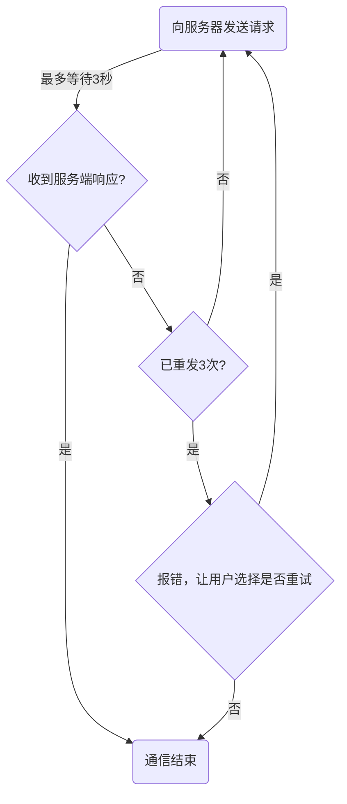
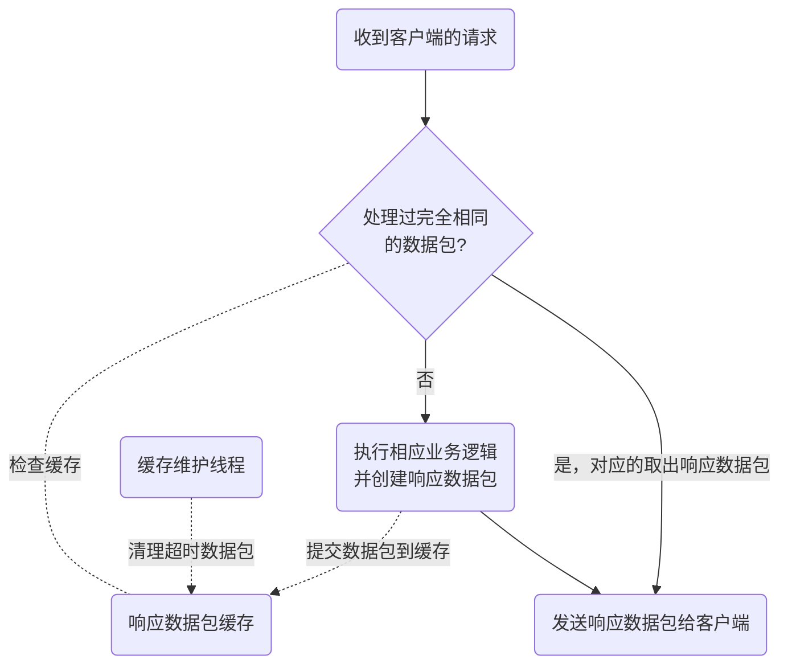
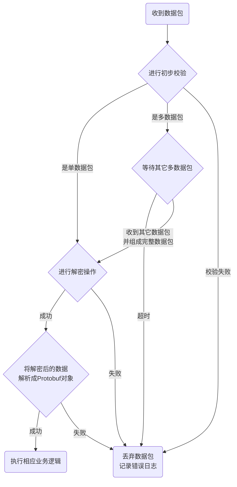

## 通讯协议

本章节将会介绍本项目的客户端和服务端之间的通讯协议：使用何种传输层通讯协议、通信方式、重发机制、报文结构。

**首先是传输层协议**，客户端和服务端之间采用的传输层协议是UDP。这是由于考虑到客户端是运行在移动端上面，而移动端有网络不稳定的特性而决定的。

**其次是通信方式**，客户端和服务端之间采用的是全部都是客户端主动请求服务端被动响应的通信方式。在介绍章节里面已经提到过，客户端是有通知功能的，当用户发布的任务有新的查询结果时，会通知用户。那么客户端是如何得知这一切呢？这里客户端采用的是轮询请求服务器的方式而不是服务端主动去通知客户端，之所以这么做是有以下几点考量：

1. 客户端网络环境不稳定，ip随时有可能发生变化，客户端不一定能收到服务端发送的通知。
2. 由于UDP不可靠的特点，服务端很难确认客户端有没有成功收到数据包，需要额外通过规定时间内收到客户端的响应来判断是否客户端收到通知。
3. 如果没收到还要考虑重发，而且不能一直重发，因为要考虑客户端离线的情况。而如果属于这种情况，客户端下次上线时，还要想办法通知客户端，这会很大程度的增加编码的复杂度和加重服务器的负担。

因此这里采用客户端轮询请求的方式，服务端不主动通知。虽然说这样会额外地产生一部分通信量，对服务器来说也是一种负担，但可以通过降低轮询频率来改善。由于通知功能对时效性没有太严格的要求（因为腾讯招聘网更新职位通常是一天一次，所以能够在半小时内得知有新职位时可以接受的），因此1分钟轮询1次甚至几分钟轮询1次都有问题。

**再次是重发机制**，因为UDP传输不可靠的特点，服务端和客户端无法保证自己发送的数据对方一定能收到，因此要提供一套数据重发机制来确保通信的可靠性。而服务端和客户端各自都有一套重发机制，为了便于理解，以下我会通过流程图的方式讲解。

首先是客户端的重发机制：

如图，客户端发出请求后，如果在3秒内没收到服务端响应，则进行重发。如果重发3次都没收到响应，则报错并让用户来选择是否要重试。通过这种方式来保证客户端通信的可靠性。

不过大家可能会发现一个问题，那就是客户端收到响应后通信好像就结束了，那么服务端怎么知道客户端有没有收到它所发送的响应数据包呢？

事实上，服务端根本不需要知道客户端有没有收到响应数据包，接下来讲一下服务端的重发机制，以下为流程图：

和客户端的重发机制不太一样，客户端没收到服务端响应时进行的是“主动重发”，而服务端进行的是针对客户端重发的数据包的“被动重发”。

服务端不关心客户端有没有收到本身发出的响应数据，但它会做好客户端没收到数据的"准备"：响应数据在发出后不会马上删除，而会被暂存到缓存中。一旦发现收到了已经处理过的数据包，则判断客户端没有收到服务端之前发出去的响应，那么就从缓存中取出来进行重发。

当然，缓存的容量也是有限的，会有个专门的维护线程清理掉超时的响应数据包。

服务端重发机制的具体代码感兴趣的话请看[程序架构&核心代码->请求处理模块->接收线程](/logic/server/server/receiver.md)章节

就这样，客户端收不到数据进行重发，服务端对重发的数据进行“再响应”，两者通过这种重发机制，实现了基于UDP协议的可靠通信。

**最后讲一下报文结构**

客户端发给服务端的请求报文和服务端返回的响应报文结构略有不同。

本项目中，客户端发给服务端的请求数据都是些小数据，不需要分包，因此请求报文的结构比较简单，如下表：
| 字节 | 内容 |
| :------ | :------ |
| 0~1  | 包长 |
| 2~  | 数据正文（密文） |

服务端在收到数据包时会进行初步校验，会检查包里记录的包长和实际包长是否一致，只有通过初步校验，才会进行后续的解密操作，因为解密需要的计算量不小，如果遭到恶意攻击的话，可能会耗费掉很多资源。通过初步校验可以过滤掉相当数量不正确的数据包，从而减轻解密工作的负担。

而服务端返回给客户端的响应报文则不同，数据包可能比较大，因为udp包的大小过大的话，容易出现丢包等问题，因此项目中限制每个数据包的大小不得超过1024字节，如果数据装不下则需要进行分包处理。

而如果分包处理的话，就要额外记录一下分的包是第几个包，一共有多少包等信息，以便接收方将被分离数据包重新组合成完整的数据。

而如果不需要分包的话，可以少记录一些信息，这样可以让数据包的大小更小一点。

因此项目将响应报文分成了两种，一种是单数据包，数据包总大小不超过1024字节；另一种是多数据包，每个包多记录了一些分包的信息，两者的结构如下(字节索引从0开始)：

*单数据包*

| 字节 | 内容 |
| :------ | :------ |
| 0~1  | 固定数字=1937 |
| 2  | 是否为多数据包=0 |
| 3~10 | 客户端发起请求的时间戳 |
| 11~12 | 包长 |
| 13~ | 数据正文（密文） |

*多数据包*

| 字节 | 内容 |
| :------ | :------ |
| 0~1  | 固定数字=1937 |
| 2  | 是否为多数据包=1 |
| 3~10 | 客户端发起请求的时间戳 |
| 11~12 | 各数据包长度总和（包含包头） |
| 13 | 数据包的个数 |
| 14 | 包序号，该数据包是第几个数据包 |
| 15~16 | 这个包的包长 |
| 17~ | 数据正文（密文） |

其中1937没有什么特别的意义，仅作为一种校验的手段。

注意包里的时间戳是**客户端发起请求的时间戳**，也就是说服务端针对客户端返回的响应数据里的时间戳，会直接使用包里的时间戳，而不是返回响应那一刻的时间戳。

为什么要加入时间戳，是为了便于客户端识别服务端返回的响应数据。如果客户端收到的数据包里的时间戳和发送请求数据时的时间戳一致，则判断该数据包是针对那个请求数据的响应。而客户端同一时间不会发送两个请求数据包，所以每个数据包的请求时间戳都是不同的，也就是说是时间戳唯一的，可以用来作为判断依据。

多数据包额外记录了包序号等信息，这样客户端收到数据包时才有办法将多数据包重组成完整的数据 。

程序在收到数据包时解包的流程图如下：

包的加密解密采用的是AES-128-GCM算法，这个网上资料不少，就不另外介绍了。

数据解密成功后，会尝试将解密后的数据解析为Protobuf对象，如果这一步也成功了，就可以根据请求/响应的具体内容执行响应的业务逻辑了。

接下来将会讲一下请求/响应数据包的Protobuf结构。