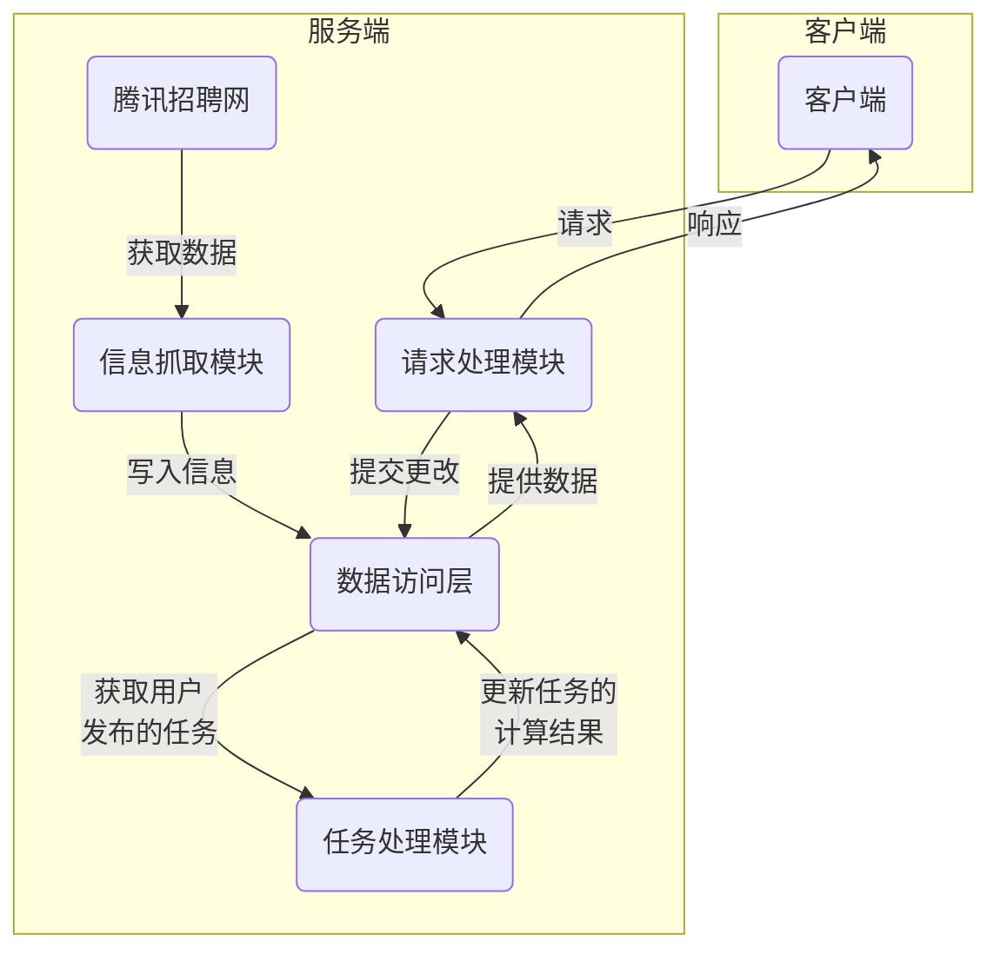

## 服务端

编程语言：C++11、python 
第三方库：boost、openssl、cpp-netlib、log4cpp、protobuf、python2.7 
数据库：mysql5.6 
运行平台：linux 

整个系统的结构如下图所示：

可以看到大部分的运算都是在服务端进行，客户端的工作主要是提交用户的需求到服务器然后将结果展示出来。

整个服务端程序按功能划分可以分为3个模块：
1. 信息抓取模块：网络爬虫，负责抓取[腾讯招聘网](https://hr.tencent.com/)的信息，整理后保存至数据访问层 ，供请求处理程序及任务处理程序使用。
2. 请求处理模块：负责处理客户端的请求并作出响应
3. 任务处理模块：后台作业程序，负责处理用户发布的任务。

接下来我会按模块逐步剖析核心组件的逻辑和代码。