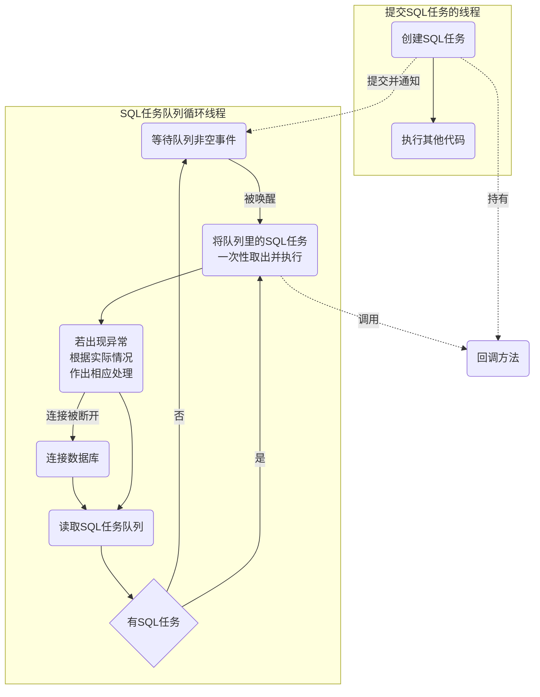

## 数据库管理类

说到服务端程序总是离不开数据库。单纯只是要操作数据库是很简单的，连接数据库，提交语句，执行，断开数据库就完事了。

但是，每次操作数据库都要写这么一大堆语句，会让代码显得杂乱不堪，影响代码的可读性，让维护变得更加困难。

而且，数据库操作也是I/O操作，是一种耗时操作，如果不能合理分配资源的话，势必会影响到程序的性能。

引入数据库管理类的目的就是让程序的数据库操作更加规范化，提高代码的可读性，和程序整体的执行效率。

因为根据本程序的设计，数据库在程序里更多是起到一种持久化的作用：将必要信息和工作现场写入数据库，然后只在程序启动时将必要数据加载到内存，后续读取数据脱离数据库，直接从通过读取内存里的容器进行。

因此这个数据库管理类对时效性的要求可以没那么高，对数据库的写操作可以异步进行，可以适当进行等待，等队列里的语句积累到一定程度后再一次性执行。

基于这个思想设计的数据库管理类流程图如下：




如图，整个数据库管理类单独占据一个线程，维护一个SQL任务队列，在程序开头就保持数据库连接不断开，不断检测SQL任务队列中是否有SQL任务，没有的话就进入休眠状态节省资源消耗，有任务再进行处理。


这里解释一下SQL"任务"。为什么叫SQL"任务"不叫SQL"语句呢"？那是因为实际操作时，我们常常需要将几条SQL语句作为一个整体来执行，比如说存储过程。这样的操作虽然是由多条语句构成，但它必须被视作一个整体，一个原子来看待：要么执行，要么不执行，不存在只执行一半的情况。


因为有这样的需求，所以队列存放的不应该是SQL"语句"，因为这样无法保证一组特定的语句的完整性。


为了解决这个问题，我引入了SQL任务这个概念，对SQL任务种类的划分如下：

1. 数据查询语言任务(DQLSqlTask)：执行一条QUERY语句，并返回查询结果。
2. 数据操纵语言任务(DMLSqlTask)：执行一条增删改语句（INSERT/UPDATE/DELETE）。
3. 复合SQL任务(MultiSqlTask)：由复数SQL任务组成。构成它的SQL任务可以是查询任务也可以是操纵任务，它不关心内部的具体构成，只确保整个SQL任务的原子性。


像这样，将一条条SQL当做任务处理，并用一个数据库管理类进行数据库操作有以下好处：

* 简化执行SQL语句的步骤，逻辑更加清晰，大大提高代码的可读性。
* 避免频繁的连接/断开数据库，避免无谓的资源浪费。
* 因为每次是从队列中取任务，我们可以使用优先级队列，让优先级高的SQL任务先执行，让代码更加灵活。
* SQL操作异步化，发起SQL操作的线程无需等待SQL语句执行完成就能继续后续操作。


关于SQL任务类的具体实现下一小节会讲，接下来先讲一下主循环的代码：


在开始循环前先连接数据库，本项目使用的是mysql5.6。

```C++
using sql::PreparedStatement;
using sql::Connection;

Logger& log(G::LogOfDatabase());
std::unique_ptr<sql::Connection> connection(nullptr);
SqlTask *current_sqltask = nullptr;
std::unique_ptr<sql::Savepoint> save_point(nullptr);

...

try
{
    //输入数据库的地址，用户名，密码，连接数据库
	 connection.reset(_driver()->connect(Conf.DBHost, Conf.DBUsername, Conf.DBPassword));
	 assert(connection != nullptr);
	 connection->setSchema(Conf.DBSchema);
	 connection->setAutoCommit(false);//取消自动提交，避免插入大量数据时缓慢
}				
catch (const sql::SQLException &e) {
	log.fatal(fmt("首次连接数据库时发生异常，程序退出，%1%")%errmsg(e));
	Global::IsGoingWell() = false;
	exit(1);//程序异常退出
}

```

注意这一句``connection->setAutoCommit(false);``很重要，它会关闭mysql的自动提交特性。如果不关闭它的话，每执行一次sql都会自动提交，当队列里有大量数据时会拖慢执行速度。

关闭了以后我们可以一次性批量执行多条sql语句后再手动提交，从而提高运行效率。


然后开始循环，先取任务：

```C++
std::deque<std::unique_ptr<SqlTask> > task_queue;//临时任务队列
int task_index = 0;//处理到第几个任务
while (Global::IsGoingWell())//当程序正常运作时
{
	try
	{
		if (task_queue.empty())
		{		
			//DLOG("队列为空等待非空事件，上锁");
			{
				std::unique_lock<std::mutex> lock(_mutex());
				if (_isEmpty())
				{
					_notEmpty().wait(lock);//无任务等待非空事件
				}
				assert(!_isEmpty());
			}
			//DLOG("接收到队列非空事件，解锁");
			//有任务，因为数据库任务的插入一般具有连续性，所以短暂等待，让队列里的任务更多一点再进行下一步
			ThreadHelper::SleerForMilliseconds(200);
			_takeAll(task_queue);
		}
```


其中``task_queue``为临时任务队列，每次它会取走主任务队列中目前拥有的所有任务。引入临时任务队列的目的是为了解决同步问题。因为提交的SQL任务来自于其它线程，因此提交SQL任务的操作和取SQL任务的操作必须互斥，因此如果直接使用主任务队列每次取一个任务的话，队列里有多少个SQL任务就要加多少次互斥锁，这样效率太慢。而如果使用临时队列的话，一次性将主队列目前拥有的任务全部取出，那就只需要加一次互斥锁就够了，这就是为什么要引入临时队列的原因。

``_isEmpty()``用来判断主任务队列是否为空，如果为空的话用条件变量阻塞队列，直到收到信号被唤醒。

``_takeAll(queue)``就是将主队列所有任务转交给临时队列的方法。


``_isEmpty()``、``_takeAll(queue)``的实现如下：

```C++
//判断队列是否非空（非线程安全）
static bool _isEmpty()
{
	for (int i = 0; i < (int)SqlTaskPriority::Size; i++)
	{
		auto &queue = _queue_sqlTask((SqlTaskPriority)i);
		if (!queue.empty())return false;
	}
	return true;
}

//把队列里的任务全部转交出去（线程安全）
static void _takeAll(std::deque<std::unique_ptr<SqlTask> >& output_queue)
{			
	//DLOG("上锁");
	std::lock_guard<std::mutex> lock(_mutex());

    //按任务优先级从高到底转交队列中的任务
	for (int i = 0; i < (int)SqlTaskPriority::Size; i++)
	{
		auto &queue = _queue_sqlTask((SqlTaskPriority)i);
		while(!queue.empty())
		{
			output_queue.emplace_back(std::move(queue.front()));
			queue.pop();
		}
	}
	//DLOG("解锁");
}
```


将主队列里目前拥有的任务全部转移到临时队列后，可以开始执行任务了，但在开始前会先检查下数据库连接是否断开，若断开则进行重连。检查上轮循环有没有遗留的保存点（如果有的话说明上一轮执行任务时发生了异常，需要回滚），确定没有问题后再进行下一步：

```C++
			//...
			_takeAll(task_queue);
		}
	
		current_sqltask = nullptr;

		if (connection==nullptr||!connection->isValid())
		{
			//如果数据库连接断开，进行重连
			reconnect();
		}

```


确认没有问题后，开始执行任务

```C++
		//上次处理了多少个任务，如果这个值不为0，则意味着上次执行任务队列的中途发生了sql错误
		int last_executed_sql_task_count = task_index;
		for (std::unique_ptr<SqlTask> &p_task : task_queue)
		{
			if (last_executed_sql_task_count-- > 0)continue;//已经执行过的sql跳过
			current_sqltask = p_task.get();
			if (p_task->get_type() == SqlTaskType::Multi)
			{
				//为了保持一致性建立保存点
				save_point.reset(connection->setSavepoint("multi_task"));
				p_task->exec_sql(connection.get());
				connection->releaseSavepoint(save_point.get());
				save_point.reset(nullptr);
			}
			else
			{
				p_task->exec_sql(connection.get());
			}
			task_index++;
		}
		connection->commit();//提交事务
		current_sqltask = nullptr;
```

``last_executed_sql_task_count``代表上一轮循环执行了多少个任务。因为任务在执行到一半有可能发生异常，如果发生异常的话，程序不会清理临时队列，而会尝试再次执行。但在发生异常的任务前执行的任务是已经执行成功了，他们不能被重复执行，因此会跳过那些已经执行成功的任务。


执行任务时，会判断任务的类型，如果发现是Multi复合任务的话，则需要保证整个复合任务的原子性，需要创建保存点，万一遇到异常可以回滚，从而保证复合任务的原子性。


执行完任务后，开始逐一调用任务的回调方法：

```C++
		//开始处理回调方法
		do
		{
			task_queue.front()->exec_callback();
			task_queue.pop_front();
		} while (!task_queue.empty());
		task_index = 0;
```

注意，回调方法为了灵活，是在主循环中直接执行的，并没有用线程池来处理（因为过于简单的回调方法交给线程池处理反而是一种资源浪费），因此在里面不能执行过于耗时的回调方法，如果有需要的话可以在回调方法内部将耗时作业转交给线程池。


程序的正常逻辑就到这里，如果没发生异常的话，循环到此就结束了，开始下一轮取任务→执行任务循环。

如果发生异常的话，则需要进行异常处理：


```C++
	//...
	}
	catch (const sql::SQLException &e)
	{
		if (connection == nullptr)
		{
			log.error("数据库意外断开，且重连失败，休息5秒后重试");
			ThreadHelper::Sleep(5);
		}
		else if (connection->isValid())
		{
			//遇到异常，先检查数据库链接是否还有效
			int error_code = e.getErrorCode();
			switch (error_code)
			{
			case 1062:
				log.errorAndNotifyAdmin(
					fmt("发生主键重复错误，很有可能是有人人为修改了数据库，该操作跳过，详情：\n\t%1%") % errmsg(e));
				task_index++;//下一轮跳过该任务
				if (save_point != nullptr)//如果有保存点
				{
					connection->rollback(save_point.get());
					connection->releaseSavepoint(save_point.get());
					save_point = nullptr;
				}
				break;
			default:
				log.errorAndNotifyAdmin(fmt("发生了未知错误[%1%]休息一分钟后再继续，详情：\n\t%2%")%error_code % errmsg(e));							
				DMLSqlTask::ClearPreparedStatementCache();//清除静态SqlTask缓存
				ThreadHelper::Sleep(60);//休息一分钟后再继续，不跳过
				break;
			}

		}			
		else
		{
			log.error(fmt("执行事务的期间链接断开，自然回滚，重做之前的操作，详情：\n\t%1%")%errmsg(e));
			task_index = 0;//初始化任务索引
			if (save_point != nullptr)
			{
				save_point.reset(nullptr);//断开连接后，保存点自动失效，不需要额外的释放操作
			}
		}
	}
}
```


到此整个主循环的代码就讲解完了，以下为整个主循环的代码：

```C++
static void Run()
{
	ThreadHelper::CreateThread([](){
		using sql::PreparedStatement;
		using sql::Connection;

		Logger& log(G::LogOfDatabase());
		std::unique_ptr<sql::Connection> connection(nullptr);
		SqlTask *current_sqltask = nullptr;
		std::unique_ptr<sql::Savepoint> save_point(nullptr);
		
		auto reconnect = [&connection]()
		{
			//不能用connection->reconnect() 用这种方法重连后会出现莫名其妙的bug
			//比如说设置任何名字的savepoint，释放时都会提示savepoint不存在的bug，故不采用
			DMLSqlTask::ClearPreparedStatementCache();//清除静态SqlTask缓存
			connection.reset(nullptr);//先清空上次的连接，这样如果连接时抛出异常的话，可以通过connection==nullptr来判断
			connection.reset(_driver()->connect(Conf.DBHost, Conf.DBUsername, Conf.DBPassword));
			connection->setSchema(Conf.DBSchema);
			connection->setAutoCommit(false);//取消自动提交，避免插入大量数据时缓慢
		};

		auto errmsg = [&current_sqltask](const sql::SQLException &e)
		{
			if (current_sqltask == nullptr)
			{
				return str(fmt("错误信息：%1%，错误码：%2%，SQLState：%3%")
					% e.what() % e.getErrorCode() % e.getSQLState());
			}					
			else
			{
				return str(fmt("执行语句[%4%]时发生错误，错误信息：%1%，错误码：%2%，SQLState：%3%")
					% e.what() % e.getErrorCode() % e.getSQLState() % current_sqltask->to_string());
			}
		};

		try
		{
			 connection.reset(_driver()->connect(Conf.DBHost, Conf.DBUsername, Conf.DBPassword));
			 assert(connection != nullptr);
			 connection->setSchema(Conf.DBSchema);
			 connection->setAutoCommit(false);//取消自动提交，避免插入大量数据时缓慢
		}				
		catch (const sql::SQLException &e) {
			log.fatal(fmt("首次连接数据库时发生异常，程序退出，%1%")%errmsg(e));
			Global::IsGoingWell() = false;
			exit(1);//程序异常退出
		}


		std::deque<std::unique_ptr<SqlTask> > task_queue;//任务队列
		int task_index = 0;//处理到第几个任务
		while (Global::IsGoingWell())//当程序正常运作时
		{
			try
			{
				if (task_queue.empty())
				{		
					//DLOG("队列为空等待非空事件，上锁");
					{
						std::unique_lock<std::mutex> lock(_mutex());
						if (_isEmpty())
						{
							_notEmpty().wait(lock);//无任务等待非空事件
						}
						assert(!_isEmpty());
					}
					//DLOG("接收到队列非空事件，解锁");
					//有任务，因为数据库任务的插入一般具有连续性，所以等一段时间再继续
					ThreadHelper::SleerForMilliseconds(200);
					_takeAll(task_queue);
				}
				
				current_sqltask = nullptr;

				if (connection==nullptr||!connection->isValid())
				{
					reconnect();
				}

				if (save_point != nullptr)//如果上次有保存点
				{
					connection->rollback(save_point.get());
					connection->releaseSavepoint(save_point.get());
					save_point.reset(nullptr);
				}

				//上次处理了多少个任务，如果这个值不为0，则意味着上次执行任务队列的中途发生了sql错误
				int last_executed_sql_task_count = task_index;
				for (std::unique_ptr<SqlTask> &p_task : task_queue)
				{
					if (last_executed_sql_task_count-- > 0)continue;//已经执行过的sql跳过
					current_sqltask = p_task.get();
					if (p_task->get_type() == SqlTaskType::Multi)
					{
						//为了保持一致性建立保存点
						save_point.reset(connection->setSavepoint("multi_task"));
						p_task->exec_sql(connection.get());
						connection->releaseSavepoint(save_point.get());
						save_point.reset(nullptr);
					}
					else
					{
						p_task->exec_sql(connection.get());
					}
					task_index++;
				}
				connection->commit();//提交事务
				current_sqltask = nullptr;

				//开始处理回调函数（就算执行失败也运行callback）

				do
				{
					task_queue.front()->exec_callback();
					task_queue.pop_front();
				} while (!task_queue.empty());
				task_index = 0;

			}
			catch (const sql::SQLException &e)
			{
				if (connection == nullptr)
				{
					log.error("数据库意外断开，且重连失败，休息5秒后重试");
					ThreadHelper::Sleep(5);
				}
				else if (connection->isValid())
				{
					//遇到异常，先检查数据库链接是否还有效
					int error_code = e.getErrorCode();
					switch (error_code)
					{
					case 1062:
						log.errorAndNotifyAdmin(
							fmt("发生主键重复错误，很有可能是有人人为修改了数据库，该操作跳过，详情：\n\t%1%") % errmsg(e));
						task_index++;//下一轮跳过该任务
						if (save_point != nullptr)//如果有保存点
						{
							connection->rollback(save_point.get());
							connection->releaseSavepoint(save_point.get());
							save_point = nullptr;
						}
						break;
					default:
						log.errorAndNotifyAdmin(fmt("发生了未知错误[%1%]休息一分钟后再继续，详情：\n\t%2%")%error_code % errmsg(e));							
						DMLSqlTask::ClearPreparedStatementCache();//清除静态SqlTask缓存
						ThreadHelper::Sleep(60);//休息一分钟后再继续，不跳过
						break;
					}

				}			
				else
				{
					log.error(fmt("执行事务的期间链接断开，自然回滚，重做之前的操作，详情：\n\t%1%")%errmsg(e));
					task_index = 0;//初始化任务索引
					if (save_point != nullptr)
					{
						save_point.reset(nullptr);//断开连接后，保存点自动失效，不需要额外的释放操作
					}
				}
			}
		}
	});
}
```


至于提交任务的代码就是一个简单的入列操作，就是加了个互斥锁而已，这里就略过了。

接下来的小节会讲一下SQL任务类的具体实现。