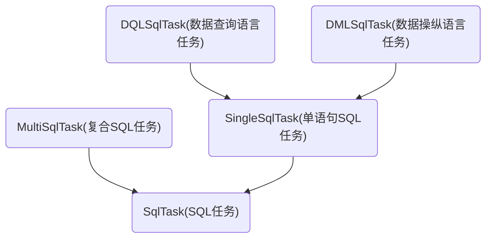

## SQL任务

本节将要讲的是SQL任务类的具体实现，如果对具体实现不感兴趣的话可以跳过本章节。

前面说过，SQL任务被分为3类：DQLSqlTask(数据查询语言任务)、DMLSqlTask(数据操纵语言任务)、MultiSqlTask(复合SQL任务)

但不管是什么SQL任务，都会排队进入数据库管理类的队列里等待被执行，那么要让3种SQL任务能进入同一个队列，它们自然要有个共同点，也就是它们拥有共同的父类。


因此设计的第一步就是SQL任务父类的设计：


### SqlTask的实现

```C++
enum class SqlTaskType
{
	DML,//数据操作语言任务
	DQL,//数据查询语言任务
	Multi//复合SQL任务
};

class SqlTask
{
public:	
	virtual void exec_callback() const = 0;//执行SQL任务的回调函数
	virtual std::string to_string() const = 0;//用来描述SQL任务，这在写日志时很有用
	virtual SqlTaskType get_type() const = 0;//SQL任务的类型
	virtual void exec_sql(sql::Connection* conn) = 0;//执行SQL任务
	inline bool execsql_succeeded() const { return m_execsql_succeeded; } //任务是否成功被执行
protected:
	SqlTask(){}
	bool m_execsql_succeeded = false;
};
```


因为实际的实例并不会创建父类，因此只定义这些方法不实现，具体实现交给SQL任务子类就好。

这样，数据库管理类在从队列里取出得到任务后，调用``exec_sql(conn)``即可，其中conn为数据库连接，执行完可后调用``execsql_succeeded()``来判断执行是否成功，调用``exec_callback()``来执行回调方法，具体怎么使用等后面的管理队列章节再讲解。


接下来就是各子类的具体实现。


先看看DQLSqlTask(数据查询语言任务)、DMLSqlTask(数据操纵语言任务)

这两种任务虽然直接继承SqlTask父类也可以，但仔细想想它们之前其实也有共性，就是它们都是执行一条语句，它们在逻辑上是有共通之处的，为了提高代码的复用率，在它们和SqlTask父类之间可以再引入一个类SingleSqlTask(单语句SQL任务)。


整体类图关系如下：




### SingleSqlTask(单语句SQL任务)的实现

```C++
class SingleSqlTask : public SqlTask
{
public:
	virtual ~SingleSqlTask(){}

	std::string to_string() const override
	{
		std::ostringstream oss;
		oss << "SQL：" << m_sql;
		if (m_vect_dataAdapter.size() == 0)
		{
			oss << " 无数据";		
		}
		else
		{
			oss <<  " 数据：";
			for (const DataAdapter& da : m_vect_dataAdapter)
			{
				oss << da.to_string() << ",";
			}
			oss.seekp(-1, oss.cur)<<"\0";
		}
		return oss.str();
	}
	
protected:
	SingleSqlTask(const std::string& static_sql, std::vector<DataAdapter>&& vect_dataAdapter) :
		m_sql(static_sql), m_vect_dataAdapter(std::move(vect_dataAdapter)){
	}
	
	//因为预编译的SQL通常是一个常量，每次创建构建task都重新复制/移动一次字符串显得有些多余
	//故此处使用引用的方式储存静态sql字符串，为避免对象在中途被销毁，传入的必须是静态字符串
	const std::string& m_sql;
	std::vector<DataAdapter> m_vect_dataAdapter;

	//准备PreparedStatement的绑定参数
	void set_pstmt_params(sql::PreparedStatement *pstmt) const
	{
		pstmt->clearParameters();//清理已绑定的参数
		int i = 0;
		for (const DataAdapter& da : m_vect_dataAdapter)
		{
			da.set_pstmt_param(pstmt, ++i);
		}
	}
};
```

它为其子类提供存放SQL字符串和传入参数的地方。这里为了提高效率避免SQL字符串重复复制，规定传入的字符串必须是静态字符串，SQL任务只存放SQL的引用而不存放SQL本身。

为了提高SQL执行效率，这里采用更高效更安全的预编译Statement，PreparedStatement。


``std::vector<DataAdapter> m_vect_dataAdapter``存放着SQL的传入参数，DataAdapter是数据适配容器，它的作用是将程序里用到的数据类型转换为可以传入PreparedStatement的类型，比如说将日期类型转换为字符串类型以便成为PreparedStatement的参数。


``set_pstmt_params()``方法的作用就是设定预编译SQL语句的参数，它会将SQL任务实例的参数传入到PreparedStatement实例当中。


### DataAdapter(数据适配器)的实现

```C++
class DataAdapter : public boost::noncopyable
{
public:
	DataAdapter() :m_p_data(nullptr), m_data_type(DataType::Null){}
	DataAdapter(int i) :m_p_data(new int(i)), m_data_type(DataType::Int){}
	DataAdapter(uint64_t s) :m_p_data(new uint64_t(s)), m_data_type(DataType::UInt64){}
	DataAdapter(bool b) :m_p_data(new bool(b)), m_data_type(DataType::Bool){}
	DataAdapter(const std::string& str) :
		m_p_data(new char[str.size() + 1]), m_data_type(DataType::String)
	{
		strcpy(static_cast<char*>(m_p_data), str.c_str());
	}
	DataAdapter(const Base::Date& date) :
		m_p_data(new char[Common::DateHelper::kSizeOfDateStrBuff]), m_data_type(DataType::Date)
	{
		Common::DateHelper::ToString(date, static_cast<char*>(m_p_data));
	}
	DataAdapter(const Base::DateTime& datetime) :
		m_p_data(new char[Common::DateHelper::kSizeOfDateTimeStrBuff]), m_data_type(DataType::DateTime)
	{
		Common::DateHelper::ToString(datetime, static_cast<char*>(m_p_data));
	}

	//转移构造函数
	DataAdapter(DataAdapter&& data_adapter) :m_p_data(data_adapter.m_p_data),m_data_type(data_adapter.m_data_type)
	{
		data_adapter.m_data_type = DataType::Null;
		data_adapter.m_p_data = nullptr;
	}

	//转移赋值函数
	DataAdapter& operator=(DataAdapter&& data_adapter)
	{
		m_data_type = data_adapter.m_data_type;
		m_p_data = data_adapter.m_p_data;
		data_adapter.m_data_type = DataType::Null;
		data_adapter.m_p_data = nullptr;
		return *this;
	}

	std::string to_string() const
	{
		switch (m_data_type)
		{
		case Base::Database::DataType::Int:
			return std::to_string(*static_cast<int*>(m_p_data));
		case Base::Database::DataType::UInt64:
			return std::to_string(*static_cast<uint64_t*>(m_p_data));
		case Base::Database::DataType::Bool:
			return std::to_string(*static_cast<bool*>(m_p_data));
		case Base::Database::DataType::String:
		case Base::Database::DataType::Date:
		case Base::Database::DataType::DateTime:
		{
			std::ostringstream oss;				
			std::string str(static_cast<const char*>(m_p_data));
			if (utf8_strlen(str) > Common::DateHelper::kSizeOfDateTimeStrBuff)
			{
				oss << "'" << utf8_substr(str, 0, Common::DateHelper::kSizeOfDateTimeStrBuff - 2) << "...'";//如果字符串太长则只打印一部分
			}
			else
			{
				oss << "'" << str << "'";
			}
			return oss.str();
		}
		default:
			return "null";
		}
	}

	//引用网上现成代码，解决utf8下substr、size失灵的问题
	static int utf8_strlen(const std::string& str)
	{
		int c, i, ix, q;
		for (q = 0, i = 0, ix = str.length(); i < ix; i++, q++)
		{
			c = (unsigned char)str[i];
			if (c >= 0 && c <= 127) i += 0;
			else if ((c & 0xE0) == 0xC0) i += 1;
			else if ((c & 0xF0) == 0xE0) i += 2;
			else if ((c & 0xF8) == 0xF0) i += 3;
			//else if (($c & 0xFC) == 0xF8) i+=4; // 111110bb //byte 5, unnecessary in 4 byte UTF-8
			//else if (($c & 0xFE) == 0xFC) i+=5; // 1111110b //byte 6, unnecessary in 4 byte UTF-8
			else return 0;//invalid utf8
		}
		return q;
	}

	static std::string utf8_substr(const std::string& str, unsigned int start, unsigned int leng)
	{
		if (leng == 0) { return ""; }
		unsigned int c, i, ix, q, min = (unsigned int)std::string::npos, max = (unsigned int)std::string::npos;
		for (q = 0, i = 0, ix = str.length(); i < ix; i++, q++)
		{
			if (q == start){ min = i; }
			if (q <= start + leng || leng == std::string::npos){ max = i; }

			c = (unsigned char)str[i];
			if (c <= 127) i += 0;
			else if ((c & 0xE0) == 0xC0) i += 1;
			else if ((c & 0xF0) == 0xE0) i += 2;
			else if ((c & 0xF8) == 0xF0) i += 3;
			//else if (($c & 0xFC) == 0xF8) i+=4; // 111110bb //byte 5, unnecessary in 4 byte UTF-8
			//else if (($c & 0xFE) == 0xFC) i+=5; // 1111110b //byte 6, unnecessary in 4 byte UTF-8
			else return "";//invalid utf8
		}
		if (q <= start + leng || leng == std::string::npos){ max = i; }
		if (min == std::string::npos || max == std::string::npos) { return ""; }
		return str.substr(min, max);
	}


	~DataAdapter()
	{
		switch (m_data_type)
		{
		case DataType::Int:
			delete static_cast<int*>(m_p_data);
			break;
		case DataType::UInt64:
			delete static_cast<uint64_t*>(m_p_data);
			break;
		case DataType::Bool:
			delete static_cast<bool*>(m_p_data);
			break;
		case DataType::String:
		case DataType::Date:
		case DataType::DateTime:
			delete[] static_cast<char*>(m_p_data);
			break;
		}
	}

	void set_pstmt_param(sql::PreparedStatement *pstmt, int index) const
	{
		switch (m_data_type)
		{
		case DataType::Int:
			pstmt->setInt(index, *static_cast<int*>(m_p_data));
			break;
		case DataType::UInt64:
			pstmt->setUInt64(index, *static_cast<uint64_t*>(m_p_data));
			break;
		case DataType::Bool:
			pstmt->setBoolean(index, *static_cast<bool*>(m_p_data));
			break;
		case DataType::String:
			pstmt->setString(index, static_cast<const char*>(m_p_data));
			break;
		case DataType::Date:
		case DataType::DateTime:
			pstmt->setDateTime(index, static_cast<const char*>(m_p_data));
			break;
		}
	}

private:
	void* m_p_data;
	DataType m_data_type;
};
```


引入这样的适配器类的目的是为了方便，不管你传入类型的是Int，String，Bool，还是Date，我们用都用一个适配器包装，这样我们在写具体业务逻辑时就不用去操心传入数据的类型了，所有的类型匹配和转换都交给适配器就好。


### DMLSqlTask(数据操纵语言任务)的实现

```C++
typedef std::function<void(const DMLSqlTask&)> DMLSqlTaskCallback;

//涉及到操作数据的任务，包括增、删、改
class DMLSqlTask :public SingleSqlTask
{
public:
	typedef std::function<void(const DMLSqlTask&)> DMLSqlTaskCallback;

	DMLSqlTask(const std::string& static_sql, std::vector<DataAdapter>&& vect_dataAdapter, DMLSqlTaskCallback&& callback) :
		SingleSqlTask(static_sql, std::move(vect_dataAdapter)), m_callback(std::move(callback)){}
	DMLSqlTask(const std::string& static_sql, std::vector<DataAdapter>&& vect_dataAdapter) :
		SingleSqlTask(static_sql, std::move(vect_dataAdapter)){}

	SqlTaskType get_type() const override
	{
		return SqlTaskType::DML;
	}

	void exec_sql(sql::Connection* conn) override
	{
		sql::PreparedStatement *pstmt = _get_pstmt(conn,m_sql).get();
		set_pstmt_params(pstmt);
		m_result = pstmt->executeUpdate();
		m_execsql_succeeded = true;
	}


	//exec_sql()执行成功才能调用
	void exec_callback() const override
	{
		assert(m_execsql_succeeded);
		if (m_callback != nullptr)m_callback(*this);
	}

	//清除pstmt缓存（数据库连接断开，或发生异常时清除）
	static void ClearPreparedStatementCache()
	{
		_pstmt_map().clear();
	}

	int get_result() const
	{
		return m_result;
	}

private:
	//返回预编译语句对象
	static std::unique_ptr<sql::PreparedStatement>& _get_pstmt(sql::Connection*& conn,const std::string& static_sql)
	{
		//如果之前已经编译过，就直接引用以前创建的预编译语句对象
		auto it = _pstmt_map().find(static_sql);
		if (it != _pstmt_map().end())
		{
			return it->second;
		}
		else
		{
			return _pstmt_map()[static_sql] = std::unique_ptr<sql::PreparedStatement>(conn->prepareStatement(static_sql));
		}
	}

	static std::unordered_map<std::string, std::unique_ptr<sql::PreparedStatement> >& _pstmt_map()
	{
		static std::unordered_map<std::string, std::unique_ptr<sql::PreparedStatement> > pstmt_map;
		return pstmt_map;
	}

	DMLSqlTaskCallback m_callback;
	int m_result;
};
```


这里使用了map来缓存PreparedStatement对象。

因为数据操纵经常会利用同一条SQL语句，比如说爬虫模块正在解析腾讯招聘网的列表页，那插入职位信息会一次性插入10条，因此这里会检测一下，如果以前编译过同样的语句那就直接把缓存里的PreparedStatement取出来就行了。

其实mysql的api可能会自动缓存PreparedStatement，所以我做的工作或许会多此一举，但我不确定它内部是怎样实现的，所以保险起见我在外层还是做了一层缓存的工作，反正就算多此一举也不会影响多少性能。


### DQLSqlTask(数据查询语言任务)的实现

```C++
typedef std::function<void(const DQLSqlTask&)> DQLSqlTaskCallback;

//涉及到查询的任务
class DQLSqlTask :public SingleSqlTask
{
public:
	typedef std::function<void(const DQLSqlTask&)> DQLSqlTaskCallback;
	DQLSqlTask(const std::string& static_sql, std::vector<DataAdapter>&& vect_dataAdapter, std::function<void(const DQLSqlTask&)>&& callback) :
		SingleSqlTask(static_sql, std::move(vect_dataAdapter)), m_callback(std::move(callback)){}
	DQLSqlTask(const std::string& static_sql, std::vector<DataAdapter>&& vect_dataAdapter) :
		SingleSqlTask(static_sql, std::move(vect_dataAdapter)){}

	SqlTaskType get_type() const override
	{
		return SqlTaskType::DQL;
	}

	sql::ResultSet* get_result() const
	{
		return m_result.get();
	}

	void exec_sql(sql::Connection* conn) override
	{
		std::unique_ptr<sql::PreparedStatement> pstmt(conn->prepareStatement(m_sql));
		set_pstmt_params(pstmt.get());
		m_result.reset(pstmt->executeQuery());
		m_execsql_succeeded = true;
	}

	//exec_sql()执行成功才能调用
	void exec_callback() const override
	{
		assert(m_execsql_succeeded);
		if (m_callback != nullptr)m_callback(*this);
	}
private:
	DQLSqlTaskCallback m_callback;
	mutable std::unique_ptr<sql::ResultSet> m_result=nullptr;
};
```


因为是异步查询，所以查询完成调用回调方法时要有个能获取到查询结果的手段，我这里将整个SqlTask对象作为回调方法的参数返回，在回调方法里调用``sqltask.get_result()``即可获取查询结果。


### MultiSqlTask(复合SQL任务)的实现

```C++
class MultiSqlTask : public SqlTask
{
public:
	MultiSqlTask(){}
	MultiSqlTask(std::list<std::unique_ptr<SqlTask>>&& tasklist)
		: m_tasklist(std::move(tasklist)){}
	~MultiSqlTask(){}

	std::string to_string() const override
	{
		std::ostringstream oss;
		oss << "任务组["<<std::endl;
		for (const std::unique_ptr<SqlTask>& task : m_tasklist)
		{
			oss << "\t" << task->to_string() << std::endl;
		}
		oss << "]" << std::endl;
		return oss.str();
	}


	SqlTaskType get_type() const override
	{
		return SqlTaskType::Multi;
	}

	void exec_sql(sql::Connection* conn) override
	{
		for (const std::unique_ptr<SqlTask>& task : m_tasklist)
		{
			task->exec_sql(conn);
		}
		m_execsql_succeeded = true;
	}

	void exec_callback() const override
	{
		if (!m_execsql_succeeded)return;
		//assert(m_execsql_succeeded);
		for (const std::unique_ptr<SqlTask>& task : m_tasklist)
		{
			task->exec_callback();
		}
	}

	void emplace(SqlTask* task)
	{
		m_tasklist.emplace_back(task);
	}

	//注意，static_sql必须是静态字符串
	template<typename... Args>
	void emplace(SqlTaskType type, const std::string& static_sql, Args&&... args)
	{
		emplace(nullptr, type, static_sql, args...);
	}

	//注意，static_sql必须是静态字符串
	//另外此处的回调函数必须是非耗时任务，如果是耗时任务需要自行在callback中把任务转交给线程池，以免阻塞整个任务循环
	template<typename Callback, typename... Args>
	void emplace(Callback&& callback,SqlTaskType type,const std::string& static_sql, Args&&... args)
	{
		std::vector<DataAdapter> vect_dataAdapter;
		//通过reserve预先开辟vector的空间，这一步非常重要，否则参数多起来的话vector会多次开辟空间并复制DataAdapter，增加无谓的开销
		vect_dataAdapter.reserve(sizeof...(args));
		emplace(std::move(callback), type, std::move(vect_dataAdapter), static_sql, args...);
	}

private:
	template<typename Callback, typename T, typename... Args>
	void emplace(Callback&& callback, SqlTaskType type,
		std::vector<DataAdapter>&& vect_dataAdapter, const std::string& static_sql,
		T&& data, Args&&... args)
	{
		vect_dataAdapter.emplace_back(data);
		emplace(std::move(callback), type, std::move(vect_dataAdapter), static_sql, args...);
	}
	template<typename Callback>
	void emplace(Callback&& callback, SqlTaskType type,
		std::vector<DataAdapter>&& vect_dataAdapter, const std::string& static_sql)
	{
		switch (type)
		{
		case SqlTaskType::DQL:
			emplace(new DQLSqlTask(static_sql, std::move(vect_dataAdapter), std::move(callback)));
			break;
		case SqlTaskType::DML:
			emplace(new DMLSqlTask(static_sql, std::move(vect_dataAdapter), std::move(callback)));
			break;
		default:
			assert(false);//不应该出现
			break;
		}
	}

private:
	std::list<std::unique_ptr<SqlTask>> m_tasklist;
};
```


复合SQL任务内部有个存放子SQL任务的容器。

执行SQL任务时会按顺序执行内部的SQL任务，调用回调方法时会调用所有子SQL任务的回调方法（如果有的话）。注意这里并没有对复合SQL任务本身的回调方法，如果有需要的话可以给最后一个子SQL任务设定回调方法。

那么如何保证整个复合SQL任务的原子性呢？我们来看看执行SQL任务的方法：

```C++
	void exec_sql(sql::Connection* conn) override
	{
		for (const std::unique_ptr<SqlTask>& task : m_tasklist)
		{
			task->exec_sql(conn);
		}
		m_execsql_succeeded = true;
	}
```

可以看到执行复合SQL任务本质上等同于执行一遍复合任务内部的子SQL任务，而其中任何一个子任务执行过程中如果出现问题（抛出异常），那么后面的``m_execsql_succeeded = true;``将不会被执行。

数据库管理类在执行复合SQL任务之前会先创建还原点，执行完毕后会判断是否成功，如果失败的话，会将数据库状态回滚到还原点的位置，是通过这种手段保证了整个复合SQL任务的原子性，具体代码请看数据库管理类章节。