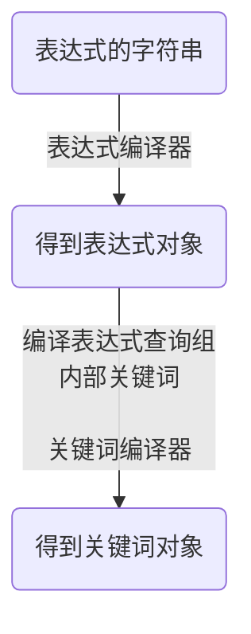

## 查询表达式编译器

关于查询表达式的详细语法请参见[附录](/manual/query/exp.md)，这里就不详细展开了。<br>

查询表达式编译器的作用就是将查询表达式编译成查询表达式对象，它有match方法，可以判断被查职位是否满足表达式，比如说以下代码：
```C++
auto expression = JobDetailQueryExpressionHelper::Parse("T{高级} && R{Java && !C++}");
Job& job = ...;
bool result = expression.is_match(job);
```

这两行代码首先编译了一个表达式，表达式的意思是一个职位标题里需含有"高级"，且职位职责包含"Java"但不包含"C++"。

得到表达式对象后，就可以判断一个职位是否满足表达式，查询功能就是利用这个表达式来实现的。


本章节将要讲的是就是这个查询表达式编译器的原理及核心代码。

我们来简单回顾下语法：<br>
查询表达式 = 查询组1 [与/或] 查询组2 [与/或] ... 查询组N<br>
查询组 = 类型代码{关键词}<br>
关键词则是由基本关键词及逻辑运算符构成。

由上可知，完整的表达式可以拆分成查询组之间的逻辑运算；而查询组可以拆分为类型代码+关键词。

因此我在设计时，将整个编译器按结构分为了两部分：**表达式编译器**和**关键词编译器**

前者的编译结果是表达式对象，由一个或多个查询组用逻辑运算符复合而成

后者的编译结果是关键词对象，是查询组的内部对象。


表达式字符串被编译的流程图：




接下来先从负责编译查询组内部关键词的**关键词编译器**开始讲解