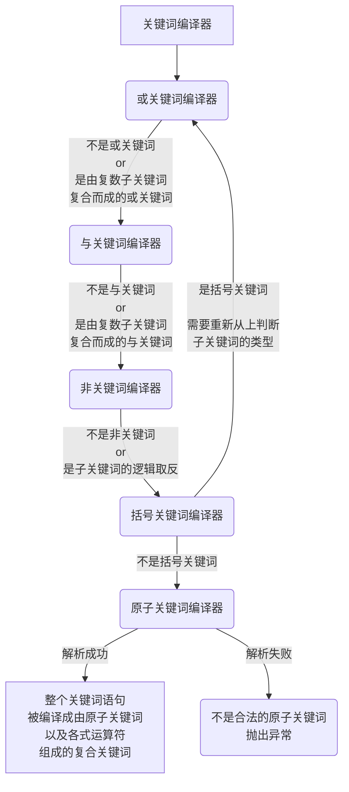

## 关键词编译器

先讲一下关键词的编译过程：

首先关键词按种类可以分为以下几种：
**原子关键词**：构成关键词的最小单位，不可分割
**括号复合关键词**： (关键词)
**非复合关键词**： ! 关键词
**与复合关键词**： 关键词1 && 关键词2
**或复合关键词**： 关键词1 || 关键词2

运算符优先级遵从C语言规则，优先级从高到低分别是
括号：()
非：！
与：&&
或：||

而进行编译时，要反过来先从运算符优先级低的编译器开始编译，按顺序分别是：
1. 或编译器
2. 与编译器
3. 非编译器
4. 括号编译器
5. 原子编译器

编译过程：
* 一个关键词，不管它是什么种类，先传入**或编译器**
* 经过**或编译器**这一层，可以确定关键词是不是**或复合关键词**。如果是，则将其拆分成 **子关键词1 || ... 子关键词N**  的形式返回，然后将各子关键词送入**与编译器**；否则将关键词原封不动地传入**与编译器**进行编译。
* 经过**与编译器**这一层，可以确定关键词是不是**与复合关键词**。如果是，则将其拆分成 **子关键词1 && ... 子关键词N**  的形式返回，然后将各子关键词送入**非编译器**；否则将关键词原封不动地传入**非编译器**进行编译。
* 经过**非编译器**这一层，可以确定关键词是不是**非复合关键词**。如果是，则将其拆分成**!子关键词**的形式返回，然后将子关键词送入**括号编译器**；否则将关键词原封不动地传入**括号编译器**进行编译。
* 经过**括号编译器**这一层，可以确定关键词是不是**括号复合关键词**。如果是，则将其拆分成**(子关键词)**的形式返回，由于括号内的子关键词种类不确定，因此要将子关键词重新传入**或编译器** ；如果不是**括号复合关键词**，那只它只有可能是**原子关键词**了，传入**原子编译器**。

这样，就已经涵盖了关键词组合的所有情况，其中**括号复合关键词**比较特殊，它可以作为一个整体跟其他关键词组合，但它内部的关键词又是一个独立空间，，内部关键词的编译又会从最开始的**或编译器**重新开始。


流程图如下：




举个例子，比如说 3年 && !出差 && (C++ || Java)  ，意思是被查语句中同时满足以下条件

1. 包含"3年"
2. 不包含"出差
3. 包含"C++"或包含"Java"


编译过程：

1. 经过或编译器，发现它是由**1个**与关键词组成的

2. 经过与编译器，发现它是由**3个**非关键词组成的

3. 编译第1个非关键词"3年"：<br>
    3.1.  经过非编译器，发现它是括号关键词<br>
    3.2.  经过括号编译器，发现它是基本关键词<br>
    3.3.  经过原子编译器，发现它是关键词"3年"，该子关键词的编译到这里完成

4. 编译第2个非关键词"!出差"：<br>
    4.1.  经过非编译器，发现它是由非运算符+括号关键词组成的，继续向下编译括号关键词的部分<br>
    4.2.  经过括号编译器，发现它是基本关键词<br>
    4.3.  经过原子编译器，发现它是关键词"出差"，第2个非关键词的编译到这里完成<br>

5. 编译第3个非关键词“(C++ || Java)”<br>
    5.1.  经过非编译器，发现它是括号关键词<br>
    5.2.  经过括号编译器，发现它不是基本关键词，需要重新经过或编译器。<br>
    5.3.  经过或编译器，发现它是由2个与关键词构成的<br>
    5.4.  两个与关键词类似上面的步骤，分别经过：与编译器→括号编译器→非编译器→原子编译器，分别编译为"C++"和"Java"，于是第3个非关键词的编译到这里完成

6. 整个关键词的编译到这里已经完成

<br>
<br>
知道了逻辑后，代码实现就容易了，思路如下：

1. 先编写关键词表达式的抽象类(Expression)，拥有匹配方法(is_match)来判断被查语句是否满足关键词表达式的条件

2. 编写关键词表达式的子类，分别是原子表达式(AtomExpression)、括号表达式(BraceExpression)、非表达式(NotExpression)、与表达式(AndExpression)、或表达式(OrExpression)，它们都实现了匹配方法，实现如下：

   原子表达式：判断被查语句是否包含自身<br>
   括号表达式：直接调用内部表达式的匹配方法<br>   
   非表达式：调用内部表达式的匹配方法后，进行逻辑非运算（逻辑取反）<br>
   与表达式：分别调用两个内部表达式的匹配方法后，进行逻辑与运算<br>
   或表达式：分别调用两个内部表达式的匹配方法后，进行逻辑或运算

3. 编写语法解析器，能读取表达式语句，按顺序转化成原子表达式或运算符。如``3年 && !出差 && (C++ || Java)``将按顺序输出：``3年``、``&&``、``!``、``出差``、``&&``、``(``、``C++``、``||``、``Java``、``)``

4. 编写各级编译器，编译器的返回结果是相应的关键词表达式对象，编译器内部将按实际情况调用语法解析器。

5. 编写将字符串转换成表达式的parse方法：将字符串传入最高级的或编译器后，就能得到复合表达式的对象了。


代码：

```C++
#pragma once
#include "base/string_hash.hpp"
#include <string>
#include <memory>
#include <iostream>
#include <cctype>

namespace Common{namespace Exp
{
	using namespace Base;
    
    //表达式
	class Expression
	{
	public:
		virtual bool is_match(const std::string& text) const = 0;
		virtual std::string to_string() const = 0;
		virtual Expression* get_class_type(){ return this; }
		virtual ~Expression(){}
	protected:
		Expression(){}
	};

	//基本表达式，最小单位
	class AtomExpression :public Expression
	{
		struct my_equal {
			my_equal(){}
			bool operator()(char ch1, char ch2) {
				return ch2 == (char)std::toupper(ch1);
			}
		};
	public:
		AtomExpression(std::string& content) :m_content(content), m_content_upper(content)
		{
			std::transform(m_content.begin(), m_content.end(), m_content_upper.begin(), ::toupper);
		}
		bool is_match(const std::string& text) const override
		{//不区分大小写
			auto it = std::search(text.begin(), text.end(), m_content_upper.begin(), m_content_upper.end(), my_equal());
			return it != text.end();
			//return text.find(m_content) != std::string::npos;
		}

		std::string to_string() const override
		{
			return m_content;
		}
		AtomExpression* get_class_type() override{ return this; }
	private:
		std::string m_content;
		std::string m_content_upper;

	};

	//括号表达式
	class BraceExpression :public  Expression
	{
	public:
		BraceExpression(const std::shared_ptr<Expression>& base_exp) :m_base_exp(base_exp){}
		bool is_match(const std::string& text) const override
		{
			return m_base_exp->is_match(text);
		}
		std::string to_string() const override
		{
			return "(" + m_base_exp->to_string() + ")";
		}
		BraceExpression* get_class_type() override{ return this; }
	private:
		std::shared_ptr<Expression> m_base_exp;
	};

	//非表达式
	class NotExpression :public  Expression
	{
	public:
		NotExpression(const std::shared_ptr<Expression>& base_exp) :m_base_exp(base_exp){}
		bool is_match(const std::string& text) const override
		{
			return !m_base_exp->is_match(text);
		}
		std::string to_string() const override
		{
			return "!" + m_base_exp->to_string();
		}
		NotExpression* get_class_type() override{ return this; }
	private:
		std::shared_ptr<Expression> m_base_exp;
	};

	//或表达式
	class OrExpression :public  Expression
	{
	public:
		OrExpression(const std::shared_ptr<Expression>& base_exp1, const std::shared_ptr<Expression>& base_exp2) :
			m_base_exp1(base_exp1), m_base_exp2(base_exp2){}

		bool is_match(const std::string& text) const override
		{
			return m_base_exp1->is_match(text) || m_base_exp2->is_match(text);
		}
		std::string to_string() const override
		{
			return m_base_exp1->to_string() + "||" + m_base_exp2->to_string();
		}
		OrExpression* get_class_type() override{ return this; }
	private:
		std::shared_ptr<Expression> m_base_exp1;
		std::shared_ptr<Expression> m_base_exp2;
	};

	//与表达式
	class AndExpression :public Expression
	{
	public:
		AndExpression(const std::shared_ptr<Expression>& base_exp1, const std::shared_ptr<Expression>& base_exp2) :
			m_base_exp1(base_exp1), m_base_exp2(base_exp2){}
		bool is_match(const std::string& text) const override
		{
			return m_base_exp1->is_match(text) && m_base_exp2->is_match(text);
		}
		std::string to_string() const override
		{
			return m_base_exp1->to_string() + "&&" + m_base_exp2->to_string();
		}
		AndExpression* get_class_type() override{ return this; }
	private:
		std::shared_ptr<Expression> m_base_exp1;
		std::shared_ptr<Expression> m_base_exp2;
	};


    //编译器，负责将字符串转换成表达式对象
	class ExpHelper : make_string_hashable
	{
	public:
		static std::shared_ptr<Expression> Parse(const std::string& text)
		{
			int offset = 0;
			std::string token = GetToken(text, offset);
			return _eval_or_expression(text, token, offset);
		}

		static std::string GetToken(const std::string& text, int& offset)
		{
			int max = text.size();
			if (max == offset)return "";

			while (offset < max && std::isspace(text[offset]))offset++;
			if (max == offset)return "";

			char ch;
			switch (ch = text[offset])
			{
			case '&':
			case '|':
				if (offset + 1 < max&&text[offset + 1] == ch)
				{
					offset += 2;
					return std::string(2, ch);
				}
				break;
			case '!':
			case '(':
			case ')':
				offset += 1;
				return std::string(1, ch);
			}

			int token_start = offset;
			while (++offset < max)
			{
				switch (ch = text[offset])
				{
				case '!':
				case '(':
				case ')':
				case ' ':
				case '\f':
				case '\n':
				case '\r':
				case '\t':
				case '\v':
					return text.substr(token_start, offset - token_start);
				case '&':
				case '|':
					if (offset + 1 < max&&text[offset + 1] == ch)
					{
						return text.substr(token_start, offset - token_start);
					}
					break;
				}
			}
			return text.substr(token_start, max - token_start);
		}


	private:

		//解析原子表达式
		static std::shared_ptr<Expression> _eval_atom(const std::string& text, std::string& token, int& offset)
		{
			using namespace Base;
			switch (h_(token))
			{
			case "&&"_h:
			case "||"_h:
			case "!"_h:
			case "("_h:
			case ")"_h:
			case ""_h:
				throw "表达式格式有误！";
			default:
				std::shared_ptr<Expression> result(new AtomExpression(token));
				token = GetToken(text, offset);
				return result;
			}
		}

		//括号表达式
		static std::shared_ptr<Expression> _eval_brace_expression(const std::string& text, std::string& token, int& offset)
		{
			std::shared_ptr<Expression> result;
			if (token == "(")
			{
				token = GetToken(text, offset);
				result.reset(new BraceExpression(_eval_or_expression(text, token, offset)));
				if (token != ")") throw "表达式格式有误！";
				token = GetToken(text, offset);
			}
			else
			{
				result = _eval_atom(text, token, offset);
			}
			return result;
		}

		static std::shared_ptr<Expression> _eval_not_expression(const std::string& text, std::string& token, int& offset)
		{
			if (token == "!")
			{
				token = GetToken(text, offset);
				return std::shared_ptr<Expression>(new NotExpression(_eval_brace_expression(text, token, offset)));
			}
			else
			{
				return _eval_brace_expression(text, token, offset);
			}
		}

		static std::shared_ptr<Expression> _eval_and_expression(const std::string& text, std::string& token, int& offset)
		{
			std::shared_ptr<Expression> result(_eval_not_expression(text, token, offset));
			while (token == "&&")
			{
				token = GetToken(text, offset);
				result.reset(new AndExpression(result, _eval_not_expression(text, token, offset)));
			}
			return result;
		}

		static std::shared_ptr<Expression> _eval_or_expression(const std::string& text, std::string& token, int& offset)
		{
			std::shared_ptr<Expression> result(_eval_and_expression(text, token, offset));
			while (token == "||")
			{
				token = GetToken(text, offset);
				result.reset(new OrExpression(result, _eval_and_expression(text, token, offset)));
			}
			return result;
		}

	};

	
}
}
```