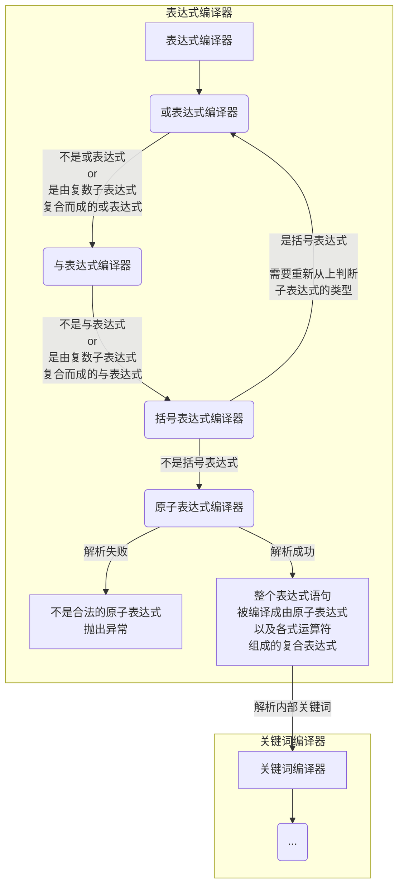

## 表达式编译器

弄懂关键词编译器以后，表达式编译器就好办了，实现其实大同小异。

先上流程图：



可以看到，前面的编译过程和关键词编译器的流程是相同的，不同的地方在于对原子表达式的编译。

关键词编译器到原子关键词的步骤就已经结束，而表达式编译器编译得到原子表达式(查询组)对象后，还要将内部关键词交给关键词编译器来编译。


表达式类代码：

```C++
//职位查询表达式，可以说是整个查询系统的核心
//包括基本、与、或、括号表达式
class JobDetailQueryExpression
{
public:
	virtual bool is_match(const Job& job) const = 0;
	virtual std::string to_string() const = 0;
	virtual JobDetailQueryExpression* get_class_type() = 0;
};

//职位查询基本表达式
//格式：[t|d|r]{内部表达式}，t表示标题，d表示职位职责，r表示职位要求
//例：r{3年&&c++} 意思是 职位要求中，同时包含关键字"3年"，"c++"
class AtomJobDetailQueryExpression :public  JobDetailQueryExpression, Base::make_string_hashable
{
public:
	AtomJobDetailQueryExpression(const std::string& type, const std::shared_ptr<Common::Exp::Expression>& inner_exp) :
		m_type(type),m_inner_exp(inner_exp){}

	bool is_match(const Job& job) const override
	{
		using namespace Base;
		switch (h_(m_type))
		{
		case "t"_h:
		case "T"_h:
		case "标题"_h:
			return m_inner_exp->is_match(job.get_title());
		case "d"_h:
		case "D"_h:
		case "职责"_h:
			return m_inner_exp->is_match(job.get_duties());
		case "r"_h:
		case "R"_h:
		case "要求"_h:
			return m_inner_exp->is_match(job.get_requirements());
		case "l"_h:
		case "L"_h:
		case "地点"_h:
			return m_inner_exp->is_match(Job::GetLocationString(job.get_location()));
		case "ty"_h:
		case "TY"_h:
		case "类别"_h:
			return m_inner_exp->is_match(Job::GetTypeString(job.get_type()));
		case "h"_h:
		case "H"_h:
		case "人数"_h:
			try
			{
				int num = std::stoi(m_inner_exp->to_string());
				return num == job.get_hiring_number();
			}
			catch (...)
			{
				return false;
			}
		default:
			return false;
		}
	}
	std::string to_string() const override
	{
		return m_type + "{" + m_inner_exp->to_string() + "}";
	}
	AtomJobDetailQueryExpression* get_class_type() override{ return this; }
private:
	std::string m_type;
	std::shared_ptr<Common::Exp::Expression> m_inner_exp;
};

//职位查询或表达式
//格式： [职位查询表达式1] || [职位查询表达式2]
class OrJobDetailQueryExpression :public  JobDetailQueryExpression
{
public:
	OrJobDetailQueryExpression(const std::shared_ptr<JobDetailQueryExpression>& base_exp1, const std::shared_ptr<JobDetailQueryExpression>& base_exp2) :
		m_base_exp1(base_exp1), m_base_exp2(base_exp2){}

	bool is_match(const Job& job) const override
	{
		return m_base_exp1->is_match(job) || m_base_exp2->is_match(job);
	}
	std::string to_string() const override
	{
		return m_base_exp1->to_string() + "||" + m_base_exp2->to_string();
	}
	OrJobDetailQueryExpression* get_class_type() override{ return this; }
private:
	std::shared_ptr<JobDetailQueryExpression> m_base_exp1, m_base_exp2;
};

//职位查询与表达式
//格式： [职位查询表达式1] && [职位查询表达式2]
class AndJobDetailQueryExpression :public  JobDetailQueryExpression
{
public:
	AndJobDetailQueryExpression(const std::shared_ptr<JobDetailQueryExpression>& base_exp1, const std::shared_ptr<JobDetailQueryExpression>& base_exp2) :
		m_base_exp1(base_exp1), m_base_exp2(base_exp2){}

	bool is_match(const Job& job) const override
	{
		return m_base_exp1->is_match(job) && m_base_exp2->is_match(job);
	}
	std::string to_string() const override
	{
		return m_base_exp1->to_string() + "&&" + m_base_exp2->to_string();
	}
	AndJobDetailQueryExpression* get_class_type() override{ return this; }
private:
	std::shared_ptr<JobDetailQueryExpression> m_base_exp1, m_base_exp2;
};

//职位查询括号表达式
//例： ([职位查询表达式1] && [职位查询表达式2]) || [职位查询表达式3]
class BraceJobDetailQueryExpression :public  JobDetailQueryExpression
{
public:
	BraceJobDetailQueryExpression(const std::shared_ptr<JobDetailQueryExpression>& base_exp) :
		m_base_exp(base_exp){}

	bool is_match(const Job& job) const override
	{
		return m_base_exp->is_match(job);
	}
	std::string to_string() const override
	{
		return "(" + m_base_exp->to_string() + ")";
	}
	BraceJobDetailQueryExpression* get_class_type() override{ return this; }
private:
	std::shared_ptr<JobDetailQueryExpression> m_base_exp;
};
```


表达式编译器代码：

```C++
//职位查询表达式编译器
class JobDetailQueryExpressionHelper : Base::make_string_hashable
{
public:
	static std::shared_ptr<JobDetailQueryExpression> Parse(const std::string& text)
	{
		int offset = 0;
		std::string token = _get_token(text, offset);
		return _eval_or_expression(text, token, offset);
	}

private:
	static std::string _get_token(const std::string& text, int& offset)
	{
		int max = text.size();
		if (max == offset)return "";

		while (offset < max && std::isspace(text[offset]))offset++;
		if (max == offset)return "";

		char ch;
		switch (ch = text[offset])
		{
		case '&':
		case '|':
			if (offset + 1 < max&&text[offset + 1] == ch)
			{
				offset += 2;
				return std::string(2, ch);
			}
			break;
		case '!':
		case '(':
		case ')':
		case '{':
		case '}':
			offset += 1;
			return std::string(1, ch);
		}

		int token_start = offset;
		while (++offset < max)
		{
			switch (ch = text[offset])
			{
			case '!':
			case '(':
			case ')':
			case '{':
			case '}':
			case ' ':
			case '\f':
			case '\n':
			case '\r':
			case '\t':
			case '\v':
				return text.substr(token_start, offset - token_start);
			case '&':
			case '|':
				if (offset + 1 < max&&text[offset + 1] == ch)
				{
					return text.substr(token_start, offset - token_start);
				}
				break;
			}
		}
		return text.substr(token_start, max - token_start);
	}

	//解析基本表达式
	static std::shared_ptr<JobDetailQueryExpression> _eval_atom(const std::string& text, std::string& token, int& offset)
	{
		using namespace Base;
		using namespace Common::Exp;
		std::string type;
		switch (h_(token))
		{
		case "t"_h:
		case "T"_h:
		case "标题"_h:
		case "d"_h:
		case "D"_h:
		case "职责"_h:
		case "r"_h:
		case "R"_h:
		case "要求"_h:
		case "l"_h:
		case "L"_h:
		case "地点"_h:
		case "h"_h:
		case "H"_h:
		case "人数"_h:
		case "ty"_h:
		case "TY"_h:
		case "类别"_h:
			type = token;
			break;
		default:
			throw "表达式格式有误！";
		}

		token = _get_token(text, offset);
		if (token != "{")throw "表达式格式有误！";

		int start_index_of_inner = offset;
		int end_index_of_inner_1 = text.find('}', start_index_of_inner);
		if (end_index_of_inner_1 == std::string::npos)throw "表达式格式有误！";

		std::string inner_text = text.substr(start_index_of_inner, end_index_of_inner_1 - start_index_of_inner);
		
		//将内部字符串交给关键词编译器编译
		std::shared_ptr<Expression> inner_exp = ExpHelper::Parse(inner_text);

		offset = end_index_of_inner_1 + 1;
		token = _get_token(text, offset);

		return std::shared_ptr<JobDetailQueryExpression>(new AtomJobDetailQueryExpression(type, inner_exp));
	}

	//括号表达式
	static std::shared_ptr<JobDetailQueryExpression> _eval_brace_expression(const std::string& text, std::string& token, int& offset)
	{
		std::shared_ptr<JobDetailQueryExpression> result;
		if (token == "(")
		{
			token = _get_token(text, offset);
			result.reset(new BraceJobDetailQueryExpression(_eval_or_expression(text, token, offset)));
			if (token != ")") throw "表达式格式有误！";
			token = _get_token(text, offset);
		}
		else
		{
			result = _eval_atom(text, token, offset);
		}
		return result;
	}

	static std::shared_ptr<JobDetailQueryExpression> _eval_and_expression(const std::string& text, std::string& token, int& offset)
	{
		std::shared_ptr<JobDetailQueryExpression> result(_eval_brace_expression(text, token, offset));
		while (token == "&&")
		{
			token = _get_token(text, offset);
			result.reset(new AndJobDetailQueryExpression(result, _eval_brace_expression(text, token, offset)));
		}
		return result;
	}

	static std::shared_ptr<JobDetailQueryExpression> _eval_or_expression(const std::string& text, std::string& token, int& offset)
	{
		std::shared_ptr<JobDetailQueryExpression> result(_eval_and_expression(text, token, offset));
		while (token == "||")
		{
			token = _get_token(text, offset);
			result.reset(new OrJobDetailQueryExpression(result, _eval_and_expression(text, token, offset)));
		}
		return result;
	}
};
```

