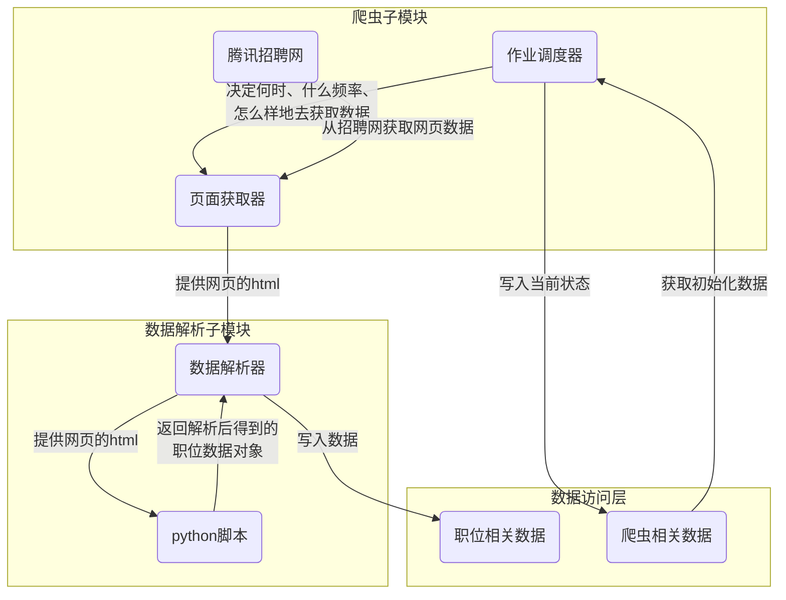

## 职位抓取模块

负责抓取[腾讯招聘网](https://hr.tencent.com/)的信息，整理后保存到数据访问层，供其他模块（用户请求处理程序，任务处理程序）使用。

其实就是所谓的网络爬虫。抓取的逻辑本身比较简单，关键是程序要足够好用，足够健壮。

重点考虑以下方面：

1. **稳定性** ： 就算抓取任务进行到一半，程序因为什么意外事件被打断退出，下次重新启动程序时能保证程序正常运转，能够继续上次被中断的任务，节约时间。 拥有健壮的异常处理机制，应对各种意料外的情况。
2. **效率** ： 腾讯招聘网更新岗位信息有一定规律，用怎样的规则进行抓取效率比较高？
3. **灵活性** ： 毕竟数据的来源是网页，很难保证以后网页的结构会一直不变，如果网页结构发生变化抓取程序自然会失效。所以当网页结构发生变化时，有没有办法尽可能简单而又快速地完成程序的更新？

先讲下灵活性。

为保证程序足够灵活，在数据来源的结构发生变化时能尽可能简单地完成更新，我将解析页面的代码独立了出来，改成用脚本语言python实现。

因为C++程序的编译相对比较耗时，更新的成本比较大。而python是脚本语言，修改代码后直接就可以使用，十分方便。

而稳定性和效率的话就是要从优化调度程序上着手了，这是属于爬虫程序的范畴。

于是我把整个信息抓取模块分成两部分，分别是**爬虫子模块**和**页面解析子模块**，整体结构如下图：

接下来会按顺序讲解两个子模块：

* 爬虫子模块
* 数据解析子模块