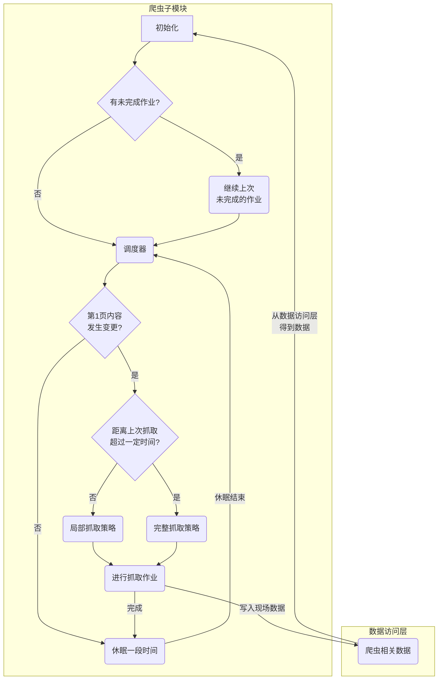

## 爬虫子模块

逻辑单纯用文字解释起来还是有点复杂的，还是先上流程图：

```mermaid
graph TD
subgraph 爬虫子模块
start[初始化]
is_working{有未完成作业?}
continue(继续上次<br>未完成的作业)
tasker(调度器)
hash_changed{第1页内容<br>发生变更?}
is_special{距离上次抓取<br>超过一定时间?}
partial_claw(局部抓取策略)
full_claw(完整抓取策略)
claw(进行抓取作业)
sleep(休眠一段时间)
end

subgraph 数据访问层
model_clawer(爬虫相关数据)
end


model_clawer -- 从数据访问层<br>得到数据 --> start
start --> is_working
is_working -- 是 --> continue
is_working -- 否 --> tasker
continue --> tasker
tasker--> hash_changed


hash_changed -- 否 --> sleep
sleep -- 休眠结束 --> tasker
hash_changed -- 是 --> is_special
is_special -- 是 --> full_claw
is_special -- 否 --> partial_claw
partial_claw --> claw
full_claw --> claw
claw -- 写入现场数据 --> model_clawer
claw -- 完成 --> sleep

```

整个爬虫子模块内容比较多，我就只讲一下自己觉得有亮点，值得一讲的部分好了，分别是：

1. 抓取策略
2. 中断续做功能
3. 第1页判断
