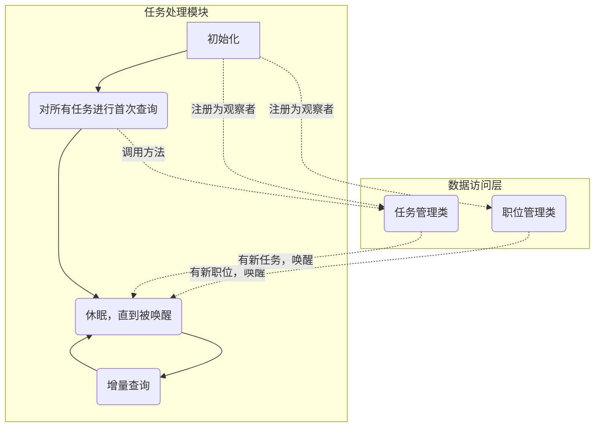

## 任务处理模块

在使用说明章节里已经介绍过，如果目前没有符合需求的职位，可以通过查询表达式创建任务，这样每当服务端发现新职位时，会判断这个职位符不符合用户所发布的任务的标准，若符合，则会将该职位添加到任务的查询结果当中去。

而任务处理模块，就是负责这件事的，流程图如下：




如图，一开始，程序会先将任务处理模块注册为任务管理类和职位管理类的观察者，这样，一旦出现新的任务，或出现新的职位，任务处理模块能够第一时间得知，代码如下：

```C++
//处理用户发布的查询任务
Service::Hunter::TencentJobInfoHunter& hunter = Service::Hunter::TencentJobInfoHunter::GetInstance();
hunter.run();
//注册有新职位且信息可用时的回调方法
Model::Job::SetNewJobAvailableCallBack([&hunter](const Model::Job& job){
	hunter.notifyHasJob(job);//通知任务模块处理有新职位
});
//注册有新任务时的回调方法
Model::Task::SetTaskAddedCallBack([&hunter](Model::Task& task){
	hunter.notifyHasTask(task);//通知任务处理模块有新任务
});
```

```C++
void TencentJobInfoHunter::notifyHasTask(Model::Task& task)
{
	Base::ScopeSpinLock l(_flag_lock);//自旋锁
	_new_task_queue.push(&task);//将任务指针放入任务队列
	_has_task_or_job_cond.notify_one();//条件变量，通知程序有新任务或新职位
}

void TencentJobInfoHunter::notifyHasJob(const Model::Job& job)
{
	Base::ScopeSpinLock l(_flag_lock);//自旋锁
	_new_job_queue.push(&job);//将职位指针放入职位队列
	_has_task_or_job_cond.notify_one();//条件变量，通知程序有新任务或新职位
}
```


然后对所有任务进行首轮查询：

```C++
//储存处理任务前，职位数据库的版本，以及任务库的new_task_id
uint64_t version_before_work = Job::GetLatestVersion();
int new_task_id_before_work = Task::GetNewTaskId();

//只在第一次进行全盘查询，之后在新增的职位和任务进行增量查询，提高效率
//返回值为进行了查询的任务清单，下次有新职位时，就可以在这个任务清单上进行增量查询
std::vector<Task*> tasks_last_query = Task::ForEach([](Model::Task& task){
	if (task.get_job_version_after() < Job::GetLatestVersion())
	{
		task.do_query();
	}
});
log.info("【任务处理模块】首轮查询完成");
```

其中``Job::GetLatestVersion()``返回的是职位管理类的数据版本，``Task::GetNewTaskId()``返回的是最新的任务Id。可以通过前后比较它们的值来判断是否有新职位/新任务。

``task.get_job_version_after()``返回的是上次进行查询时，职位类的数据版本号。如果当前的数据版本号不比上次查询时的版本号要新的话，说明并没有新职位出现，可以略过查询步骤。


接着，再进行首轮查询之后，除非有新职位或用户新发布的任务，那么任务处理模块已经无事可做，可以进入休眠状态直到被唤醒：

```C++
while (true)
{
	//执行任务前，执行任务后，职位及任务都没有新数据，说明已经没有需要处理的新任务，进入休眠状态
	if (version_before_work == Job::GetLatestVersion() && new_task_id_before_work == Task::GetNewTaskId())
	{
		_has_task_or_job_cond.wait(cond_lock, [this]{
			Base::ScopeSpinLock l(_flag_lock);
			return !_new_job_queue.empty() || !_new_task_queue.empty();
		});
	}
    //接下...
```


被唤醒后，判断是有新任务还是有新职位，还是两者皆有，根据实际情况进行相应的增量查询：

```C++
	//...接上
	version_before_work = Job::GetLatestVersion();
	new_task_id_before_work = Task::GetNewTaskId();

	//新增加的职位和任务
	std::vector<const Job*> jobs_added;
	std::vector<Task*> tasks_added;

	//分别从职位队列和任务队列中取出新职位，新任务
	{
		Base::ScopeSpinLock l(_flag_lock);
		while (!_new_job_queue.empty())
		{
			jobs_added.emplace_back(_new_job_queue.front());
			_new_job_queue.pop();
		}
		while (!_new_task_queue.empty())
		{
			tasks_added.emplace_back(_new_task_queue.front());
			_new_task_queue.pop();
		}
	}
	
	//基于职位的增量查询
	if (jobs_added.size() > 0)
	{		
		log.info("【任务处理模块】有新的职位，开始增量查询");

		for (auto it = tasks_last_query.begin(); it != tasks_last_query.end();)
		{
			auto* p_task = *it;
			if (!p_task->exist())//清理已实质不存在的Task
			{
				it = tasks_last_query.erase(it);							
			}
			else
			{
				int count = p_task->do_query(jobs_added);
				log.info(fmt("【任务处理模块】任务[%1%]，增量查询结果个数：%2%") % p_task->get_id() % count);
				it++;
			}
		}

	}
	//基于任务的增量查询
	if (tasks_added.size() > 0)
	{
		log.info("【任务处理模块】有新的任务，开始增量查询");
		for (Task* p_task : tasks_added)
		{
			if (!p_task->exist())continue;
			int count = p_task->do_query();
			log.info(fmt("【任务处理模块】新任务[%1%]，查询结果个数：%2%") % p_task->get_id() % count);
			
			tasks_last_query.emplace_back(p_task);
		}
	}
}
```


执行结束后，再次进入休眠状态，直到下一次被唤醒，任务处理模块的程序逻辑到此就结束了。

（关于用查询表达式进行查询的代码和原理请看[公共组件-查询表达式编译器](/logic/server/base/queryexp.md)章节）
