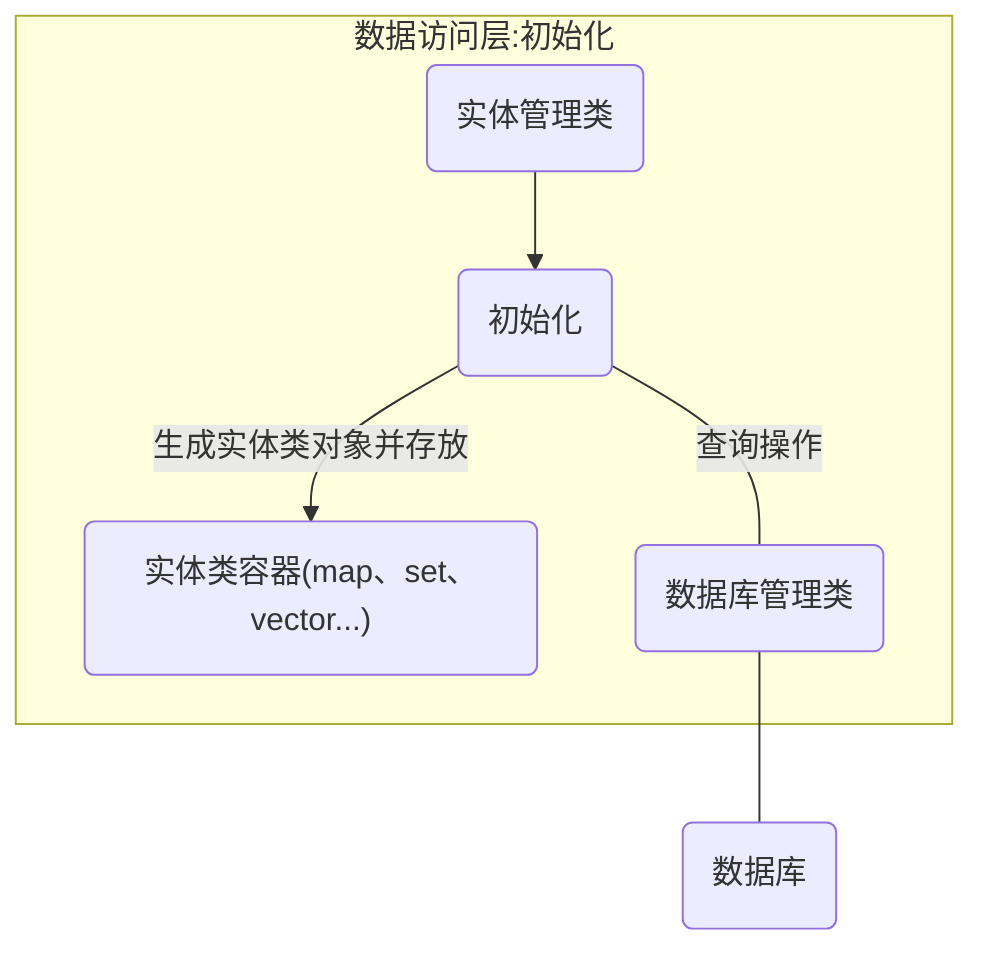
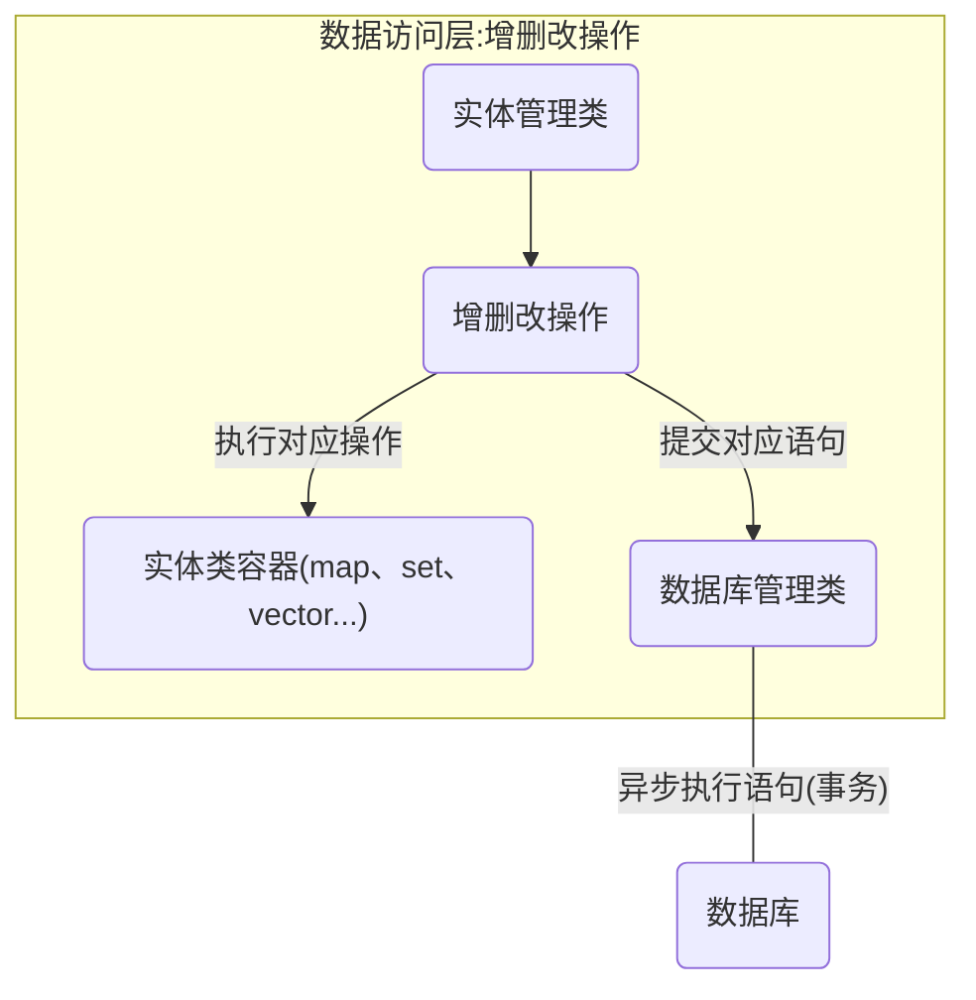
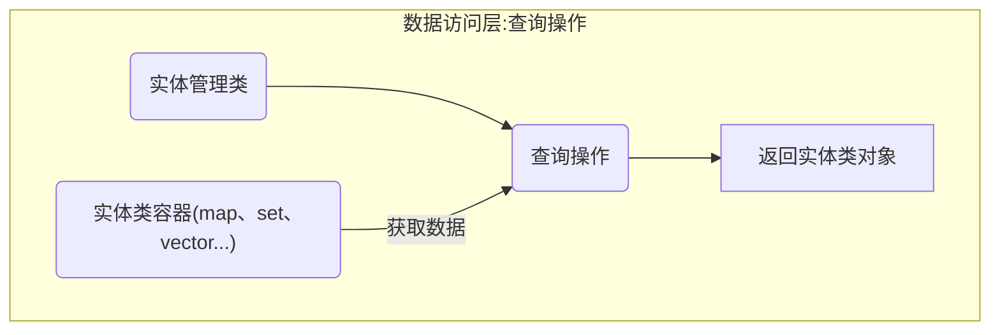
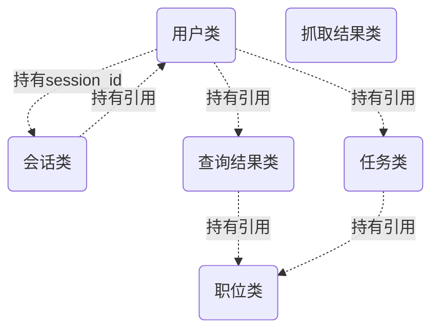

## 数据访问层

数据访问层，这个词大家应该不会陌生。没错，就是负责数据操作和访问的层，前面章节已经讲到的3个模块都会调用这个层的方法。

本层由各实体(Model)类和实体管理类组成，实体类的实例存放具体的业务数据，实体管理类则是对实体实例进行增删查改操作。

逻辑上和其他程序没有什么区别，做的都是增删查改的事情，但具体结构和行为上可能有点不一样。

结合本项目的实际情况，并不会有特别庞大的数据量，数据完全可以全部存放在内存中。

因此，为了提高效率，对数据的操作和访问并不是直接的``实体(Model)类-数据库``的形式，而是``实体(Model)类-实体类容器(内存)-数据库``的形式。

按行为划分我将数据访问层的操作分为三类：

1. 初始化：进行数据库查询操作，将数据库的数据同步到实体类容器当中。
2. 数据操纵(增/删/改)：直接对实体类或实体类容器进行增删改操作，然后提交对应的数据操纵语句到数据库管理类，由数据库管理类对数据库进行异步写操作。
3. 数据查询：根据实际情况用对应的方法查找实体类容器并返回结果，不涉及到数据库操作。


可以看到，数据库在本项目中起的更多的是一种持久化的作用，数据库的在程序里的作用就是在启动程序时将必要数据同步到内存的容器里，之后访问数据直接会访问内存里的容器，没数据库什么事了。这样做的好处是数据访问快，效率高；缺点是程序运行时会占用比较高的内存，所以业务数据比较庞大的项目不适用这种方法。所幸本项目的应用场景不会涉及到特别庞大的数据量，直接将数据存放在内存里是可以接受的。


以下为三类操作的大致流程图：

**初始化**




**数据操纵(增删改)**




**查询**




不过虽然我在讲解时将实体类和实体管理类分开，但在实际的代码里为了简洁我将他们合在了一起。调用实例方法时做的是实体类的事情，而调用静态方法时做的是实体管理类的事情 ，比如说``Model::Job``职位类。

现在要访问某个职位的工作要求：

```C++
Model::Job& job = ...
job.get_requirements();
```

这做的是实体类的事情，是对某个具体职位的操作。


而比如说现在要通过职位的id、标题、类别、工作地点等信息增加一个职位：

```C++
Model::Job& job = Model::Job::Add(id,title,type,location,...)
```

这做的是实体管理类的事情，是对整个职位库的操作。


实体(管理)类一共有以下几种：

| 类名           |                             描述                             |
| -------------- | :----------------------------------------------------------: |
| Job            | 职位类，存放职位信息，包括职位的id、标题、类别、工作地点等信息 |
| User           |  用户类，存放用户信息，包括用户名、密码(密文)、email等信息   |
| Session        | 会话类，存放和客户端交互的会话信息，包括session_id、对应的用户等信息 |
| JobQueryResult |              查询结果类，存放职位信息的查询结果              |
| Task           | 任务类，存放用户发布的查询任务的信息，包括查询表达式、截止日期等信息，也包含查询结果，可以看作是变种的查询结果类。 |
| JobClawResult  |       抓取结果类，存放信息抓取模块(网络爬虫)的抓取结果       |

除了抓取结果类是独立的之外，其他类之间有些有着相互引用的关系，虚线表示持有该类引用，如下图：




接下来将按顺序讲解