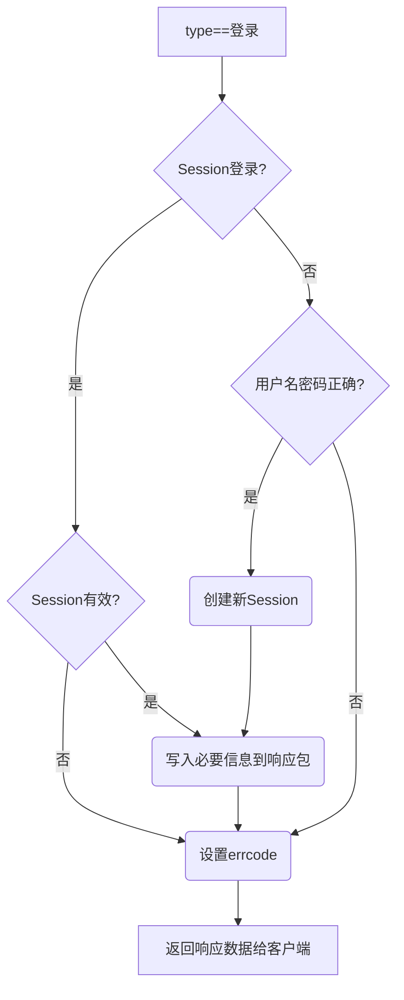
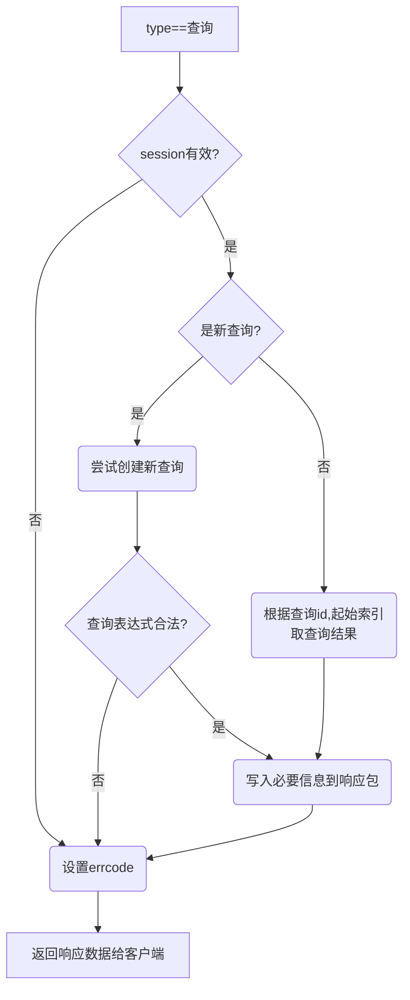

## 请求处理(节选)

请求处理的具体业务逻辑我只打算选讲，毕竟种类太多（登录、注册、查询、删除查询记录、查看职位详情、添加任务、删除任务等等）全部展开来就太多了，而且内容大同小异没必要全部讲。

这里只讲下登录和查询

### 登录

先上流程图：



代码：

```c++
void TencentJobUserServer::_deal_with_login_request(const TencentJobHunterMessage::Request& request, Base::AsioServer::ResponseSender* response_sender_ptr)
{
	//秘钥
	const char* key = Conf.AesKey.c_str();

	//创建响应信息
	TencentJobHunterMessage::Response response;
	response.set_type(TencentJobHunterMessage::Type::LOGIN);
	response.set_request_time(request.request_time());

	//解析客户端请求
	bool success_flag = false;
	Model::User* user;
	Model::Session* session;
	std::string session_id = request.session();

	if (session_id != "")
	{
		if ((session = Model::Session::GetSessionPointer(request.session())) != nullptr){
			//基于session的快速登录
			user = &session->get_user();
			success_flag = true;
		}
		else
		{
			_send_response(response, response_sender_ptr, TencentJobHunterMessage::ErrorCode::SESSION_INVALID_ID);
			return;
		}
	}
	else
	{
		std::string username = request.username();
		std::string password = request.password();

		user = Model::User::GetPointer(username);

		if (user != nullptr)
		{
			std::string salt = user->get_salt();
			std::string m_pass_md5 = user->get_pass();
			std::string pass_md5 = Common::CryptoHelper::MD5(password, salt);

			//密码比对正确，登录成功
			if (pass_md5 == m_pass_md5)
			{
				success_flag = true;

				//创建session并保存
				//如果没有session_id则创建一个全新的
				if (!Model::Session::GetSessionIdByUser(*user, session_id))
				{
					Model::Session& session =
						Model::Session::CreateSession(*user);
					session_id = session.get_id();
					user->set_session(session_id);
				}
			}
		}
	}

	if (success_flag)
	{
		//将session写入response
		response.set_session(session_id);

		//写入职位类型映射消息
		response.mutable_job_related_info()->CopyFrom(Model::Job::GetRelatedInfo());

		//写入查询结果记录（只写入概要信息，不写入详细数据）
		user->set_query_result_info_proto(response.mutable_job_query_result_info());

		//任务查询结果的最后更新时间，可以通过比较更新时间来判断任务列表以及查询结果是否有变化
		response.set_task_query_result_changed_time(user->get_task_query_result_changed_time());


		response.set_error_code(TencentJobHunterMessage::ErrorCode::SUCCESS);
	}
	else
	{
		//失败返回1001（用户名密码错误）  
		response.set_error_code(TencentJobHunterMessage::ErrorCode::LOGIN_INCORRECT_PASS);
	}

	_send_response(response, response_sender_ptr);

}
```


可以看到，登录分为两种，一种是基于session的快速登录，一种是基于用户名密码的登录。

在第一次登录时会使用用户名密码，一旦成功登录过，客户端下次会使用服务端返回的session来快速登录，直到session失效。

如果登陆成功，则会写入客户端初始化需要的一些信息，包括

- session
- 职位类型映射信息（技术类=1，产品项目类=2，市场类=3等等)
- 查询结果概要（用户发起的查询，结果会保存在服务器。除非收到客户端的删除指令）
- 任务查询结果的最终更新时间（用这个时间进行比较，如果比客户端本地时间新的话代表任务有新的查询结果）

然后无论登陆成功失败，都会写入error_code，成功的话返回0(SUCCESS)，失败的话则返回响应的失败代码。

最后调用``_send_response``向客户端做出响应。

```c++
void TencentJobUserServer::_send_response(TencentJobHunterMessage::Response& response, Base::AsioServer::ResponseSender* response_sender_ptr)
{
	//秘钥
	const char* key = Conf.AesKey.c_str();

	//序列化，输出数据
	char response_buff[65536];
	char aes_buff[65536];
	int size_before_encrypt = response.ByteSize();
	response.SerializeToArray(response_buff, size_before_encrypt);


	//对数据加密
	int size_after_encrypt = Common::CryptoHelper::AES_128_GCM_Encrypt(response_buff, size_before_encrypt, key, aes_buff);
	response_sender_ptr->fillData(aes_buff, size_after_encrypt, response.request_time());

	//给客户端发送响应信息
	log.debug(fmt("向客户端[%1%]发送响应...") % response_sender_ptr->remote_address());
	response_sender_ptr->async_send();
}
```

protobuf对象将会被序列化→然后加密→拆包(一个包最大1024B)→最后发送


### 查询

流程图：


由于查询结果个数可能很多，如果结果个数太多，一次性全部返回的话数据量太大。

因此程序会自动对查询结果进行分页，每页10条记录。

因此查询请求其实分为两种，一种是全新查询，返回第一页的查询结果；另一种则是获取已有查询结果，根据起始索引返回一部分查询结果。


以下为代码：

```c++
void TencentJobUserServer::_deal_with_new_job_query_request(const TencentJobHunterMessage::Request& request, Base::AsioServer::ResponseSender* response_sender_ptr)
{
	//秘钥
	const char* key = Conf.AesKey.c_str();

	//创建响应信息
	TencentJobHunterMessage::Response response;
	response.set_type(TencentJobHunterMessage::Type::ADD_JOB_QUERY);
	response.set_request_time(request.request_time());


	//解析客户端请求
	std::string session_id = request.session();

	Model::Session* p_session = Model::Session::GetSessionPointer(session_id);
	bool success_flag = p_session != nullptr;

	if (success_flag)
	{
		response.set_session(session_id);
		auto query_option = request.job_query_option();
		int start_index = query_option.start_index();

		std::vector<const Model::Job*> job_list;				
		int query_no = query_option.query_no();
		std::string query_id = query_option.query_id();
		uint64_t version;
		bool query_valid = false;

		//query_id为空，代表是新查询，否则获取已有查询的查询结果
		if (query_id != "")
		{					

			query_valid = Model::JobQueryResult::Use(query_id, [&version, &job_list](Model::JobQueryResult* result){
				result->get_datas(job_list);
				version = result->get_version();
			});
		}
		else
		{
			//查询表达式
			std::string query_expresion = query_option.query_expression();

			try
			{
				version = Model::Job::GetLatestVersion();
				auto exp = Model::Job::Query(query_expresion, job_list);

				Model::JobQueryResult& query_result = Model::JobQueryResult::Add(p_session->get_user(), query_no, query_expresion, job_list, version);
				query_id = query_result.get_id();
				query_result.set_expression(exp);
				query_valid = true;
			}
			catch (...)
			{
				//由于客户端发送前就会事先检查表达式是否合法
				//所以按正常流程走是不可能收到非法表达式的
				//但安全起见这里还是要做个catch(防止恶意攻击)
				log.error("表达式格式非法");
			}

		}

		if (query_valid)
		{
			//由于查询结果可能很多，一次性发送数据量太大
			//所以查询结果会自动分页
			//一次只返回10条查询结果，需要更多查询结果只要在请求中修改start_index即可
			int max_length = job_list.size();
			int page_length = max_length - start_index < 10 ? max_length - start_index : 10;

			TencentJobHunterMessage::JobQueryResult& result = *response.mutable_job_query_result();
			for (int i = start_index; i < start_index + page_length; i++)
			{
				TencentJobHunterMessage::Job* p_m_job = result.add_list();
				const Model::Job* p_job = job_list[i];

				//写入职位ID，标题，类型，地点，招聘人数，日期
				p_m_job->set_id(p_job->get_id());
				p_m_job->set_title(p_job->get_title());
				p_m_job->set_type(p_job->get_type());
				p_m_job->set_location(p_job->get_location());
				p_m_job->set_hiring_number(p_job->get_hiring_number());
				p_m_job->set_date(Common::DateHelper::ToString(p_job->get_date()));
			}

			//写入查询id，查询no，总结果个数，起始index
			result.set_query_id(query_id);
			result.set_query_no(query_no);
			result.set_max_length(max_length);
			result.set_start_index(start_index);
			result.set_version(version);

			response.set_error_code(TencentJobHunterMessage::ErrorCode::SUCCESS);
		}
		else
		{
			//非法表达式
			response.set_error_code(TencentJobHunterMessage::ErrorCode::QUERY_INVALID_EXPRESSION);
		}


	}
	else
	{
		//非法session
		response.set_error_code(TencentJobHunterMessage::ErrorCode::SESSION_INVALID_ID);
	}


	_send_response(response, response_sender_ptr);
}
```


关于查询表达式解释器的实现将会在公共组件部分讲解，这里暂且跳过。