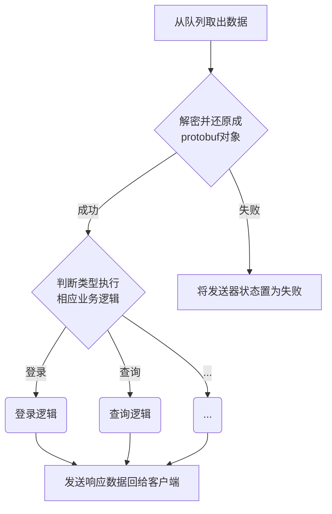

## 工作线程池

整体流程图如下：


前面讲到了接收线程在收到新数据时会将数据插入队列，那么工作线程自然是要取数据了，取数据的代码如下：

```c++
while (true)
{
    std::unique_lock<std::mutex> lock(mutex_request_data_queue);
    if (request_data_queue.empty())
    {
        //如果队列为空，则阻塞等待，直到队列有数据为止
        cv_queue_not_empty.wait(lock);
    }
    do
    {
        //从队列中取出一个请求，并处理
        lock.lock();
        auto t = std::move(request_data_queue.front()); 
        request_data_queue.pop();
        lock.unlock();
		
        //提交到线程池执行
        pool.execute([t = std::move(t), &recv_data_handler](){
            recv_data_handler(t.first, t.second);
        });        
    } while (!request_data_queue.empty());
}
```

这里使用了条件变量，如果队列为空则会先休眠，直到被唤醒。被唤醒后，循环从队列取出数据，交给线程池执行具体业务，直到队列再次为空。

途中有数次上锁解锁的操作，来保证队列的线程安全。

（关于线程池我自己没有造轮子，更多参考了网上的代码。但经过多番对比后我发现有些线程池的实现是有问题的，所以说用别人的东西还是要谨慎。关于我对线程池的考察，有兴趣可以看看：[线程池](/logic/server/base/threadpool.md)）


然后就是对数据的解密，判断出类别，在执行相应的代码。数据包的加密解密使用aes-128-gcm算法，数据使用protobuf包装，详细请看[通讯协议](/logic/proto.md)环节。

```c++
auto recv_data_handler = [this](const Base::AesCipherBuffer& request_data, Base::AsioServer::ResponseSender* response_sender_ptr){

    //秘钥
    const char* key = Conf.AesKey.c_str();

    char request_buff[1024];
    //对收到的数据进行AES解密
    int ret_size = Common::CryptoHelper::AES_128_GCM_Decrypt(request_data.const_pointer() + 2, request_data.size() - 2, key, request_buff);

    //将数据包还原成protobuf对象
    TencentJobHunterMessage::Request request;
    if (request.ParseFromArray(request_buff, ret_size))
    {
        switch (request.type())
        {
        case TencentJobHunterMessage::Type::LOGIN:
            _deal_with_login_request(request, response_sender_ptr);
            break;
        case TencentJobHunterMessage::Type::REGISTER:
            _deal_with_register_request(request, response_sender_ptr);
            break;
        case TencentJobHunterMessage::Type::ADD_JOB_QUERY:
            _deal_with_new_job_query_request(request, response_sender_ptr);
            break;
        //...根据类别执行不同的业务逻辑，数量较多就不铺开了
        }
    }
    else
    {
        log.debug_with_data("解析响应时出错，写入解密前数据信息", request_data.const_pointer(), request_data.size());
        log.debug_with_data("写入解密后数据信息", request_buff, ret_size);
        //解析响应时出错，更新发送器状态
        response_sender_ptr->set_status_parse_error();
    }
};

```


